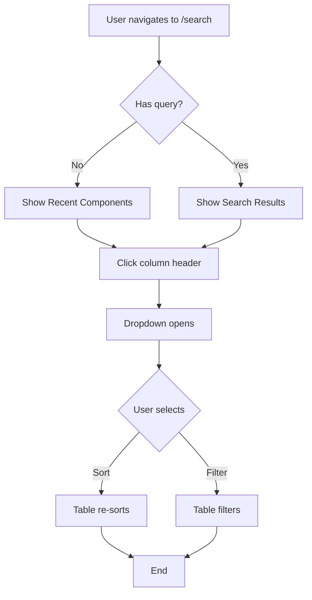

<!-- Powered by BMAD™ Core -->

# create-user-journey

Create a concise, visual user journey narrative from an approved development story. This task translates technical requirements into a clear step-by-step user experience flow.

## Purpose

After story approval but before development begins, this task creates a narrative "walk-through" that:
- Clarifies the user experience for the entire team
- Surfaces UX assumptions and decision points
- Provides a shared understanding between PO, Dev, and QA
- Serves as acceptance criteria validation tool

## Inputs

```yaml
required:
  - story_path: 'Path to approved dev story file'
  - story_id: '{epic}.{story}' # e.g., "9.1"

optional:
  - include_visual: true # Generate Mermaid diagram
  - output_path: 'docs/user-journeys/' # Default location
  - persona: 'Which user persona is using this feature'
```

## Prerequisites

- Story status must be "Approved" or "Ready for Development"
- Story must have clear acceptance criteria
- Story must describe user-facing functionality (skip for backend-only stories)

## Processing Flow

### 1. Story Analysis

Read the approved story and extract:
- **Core Feature**: What is being built?
- **User Goal**: What is the user trying to achieve?
- **Entry Point**: Where does the user start this journey?
- **Success Criteria**: How does the user know they succeeded?
- **Personas**: Who is the intended user? (default: "User" if not specified)

### 2. Journey Mapping

Create a sequential flow:
1. **Identify trigger**: What prompts the user to start?
2. **Map user actions**: Each click, input, or decision
3. **Document system responses**: What happens after each action?
4. **Highlight decision points**: Where users make choices
5. **Note edge cases**: Error states, validations, empty states
6. **Define completion**: Clear end state

### 3. Narrative Creation

Write in this format:

```markdown
# User Journey: {Feature Name}

**Story**: {epic}.{story} - {story title}
**Persona**: {user type}
**Goal**: {what user wants to accomplish}

## Context
{1-2 sentences: Why is user doing this? What problem are they solving?}

## Entry Point
User {action that starts journey}

## Step-by-Step Flow

### Step 1: {Action Name}
**User Action:** {What user does - be specific about clicks, inputs, etc.}
**System Response:** {What UI displays or changes}
**Visual Cues:** {What user sees - buttons, messages, highlights, etc.}

### Step 2: {Next Action}
**User Action:** ...
**System Response:** ...
**Validation/Feedback:** {Any error messages, confirmations, or guidance shown}

{Continue for all steps...}

## Decision Points
{List any places where user must make a choice, with consequences}

## Edge Cases & Error States

### Scenario: {Edge case name}
**Trigger:** {What causes this}
**System Behavior:** {How system handles it}
**User Experience:** {What user sees/does}

## Success Completion
**User sees:** {Final state of UI}
**User knows they succeeded because:** {Clear indicators}
**Next actions available:** {What can user do next?}

## Visual Flow
{Mermaid diagram or ASCII art showing flow}
```

### 4. Visual Flow Generation (if include_visual: true)

Generate a Mermaid flowchart showing:
- Decision diamonds for user choices
- Rectangles for actions
- Rounded rectangles for system states
- Dotted lines for error/edge cases

Example:


## Output

Create file: `{output_path}/journey-{epic}.{story}-{slug}.md`

Default path: `docs/user-journeys/` (unless overridden in core-config.yaml)

## Quality Checks

Before finalizing, verify:
- [ ] Every acceptance criteria is reflected in the journey
- [ ] All user actions are clickable/typeable (not vague)
- [ ] All system responses are observable (not internal logic)
- [ ] Error states and validations are documented
- [ ] Success state is crystal clear
- [ ] Journey is concise (1-3 pages max)
- [ ] Non-technical stakeholders can understand it

## When to Skip This Task

Skip user journey creation if:
- Story is backend-only (no UI changes)
- Story is a pure refactoring (no UX changes)
- Story is infrastructure/configuration
- User experience is identical to existing patterns

For these cases, note: "User journey not applicable - {reason}"

## Example Use Cases

✅ **Good fits:**
- New feature with UI (Story 9.1: Excel-style column filtering)
- Multi-step workflows (checkout, onboarding)
- Complex interactions (drag-and-drop, file uploads)
- Features with decision trees

❌ **Poor fits:**
- "Upgrade React version from 17 to 18"
- "Add database index on user_id column"
- "Refactor service layer for better testability"

## Integration with BMAD Workflow

```
Story Approved → *task create-user-journey → Review with team → Dev starts
                                                ↓
                                    (Used by QA for acceptance testing)
```

## Tips for Success

1. **Be specific**: "Click the 'Type' column header" not "filter the results"
2. **Show, don't tell**: Describe what user SEES, not internal logic
3. **Include screenshots references**: "(See mockup in story)" when available
4. **Use active voice**: "User clicks..." not "The button can be clicked..."
5. **Keep it scannable**: Use bullets, bold, and clear headings
6. **Test it yourself**: Can you follow the journey without the code?

## Completion Checklist

After creating the journey:
- [ ] Share with PO for accuracy validation
- [ ] Share with Dev for feasibility check
- [ ] Share with QA to inform test planning
- [ ] Reference in story's "User Journey" section (if story template has one)
- [ ] Store in docs/user-journeys/ for future reference

## Agent Recommendations

**Best assigned to:**
- Product Owner (PO) - Knows user needs deeply
- UX Designer - If available in team
- Scrum Master (SM) - Can facilitate if PO unavailable

**Should involve:**
- Dev team - Validate technical feasibility
- QA - Will use for acceptance testing

## Notes

- This is a **communication tool**, not a technical spec
- Focus on the "what" and "why", not the "how"
- Diagrams should clarify, not complicate
- Update journey if story changes during development
