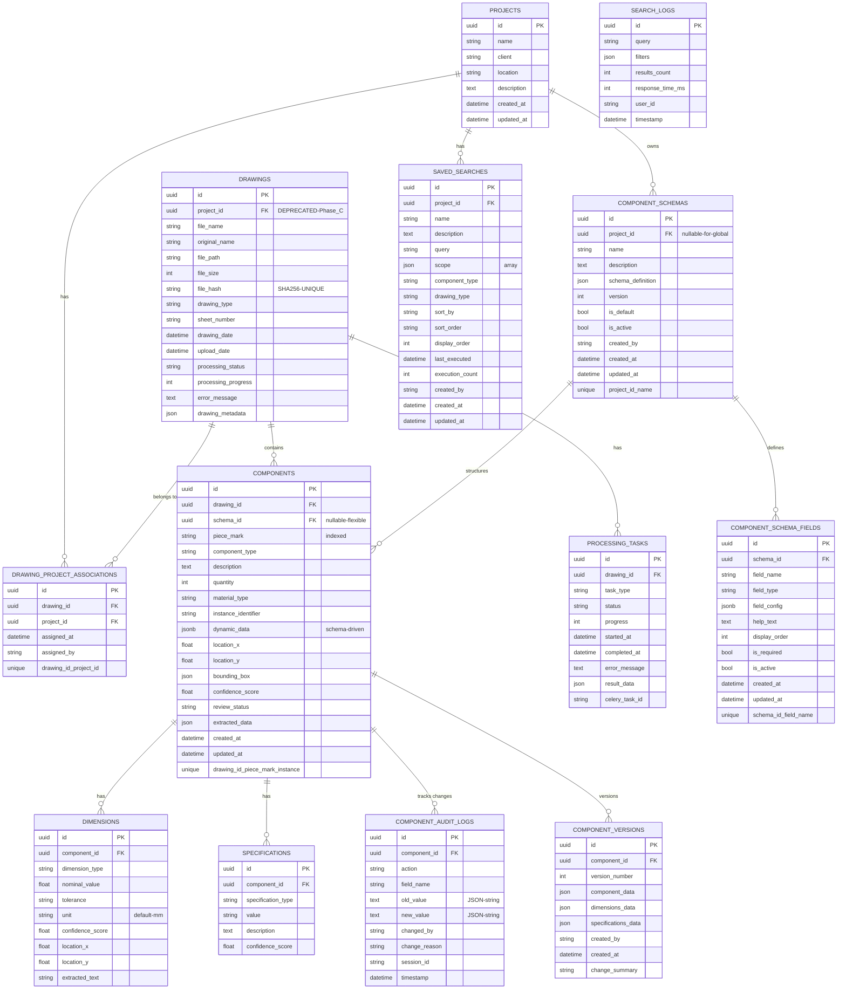

# Database Schema - Engineering Drawing Index System

**Document Version**: 1.0
**Last Updated**: 2025-10-11
**Database**: PostgreSQL 14 with PostGIS
**Status**: As-Built (Current Production Schema)

---

## Executive Summary

This document provides a comprehensive view of the Engineering Drawing Index System database schema as currently implemented. The schema supports:

- **Multi-project drawing management** with many-to-many relationships (Story 8.1a)
- **Flexible component schemas** with dynamic field definitions
- **Component versioning and audit trails** for change tracking
- **Search functionality** with saved searches per project
- **OCR and processing task tracking** for async operations

**Key Design Patterns**:
- UUID primary keys for all entities
- JSONB for flexible/dynamic data storage
- Soft deletes via cascade constraints
- Timestamp tracking (created_at, updated_at)
- Composite unique constraints for data integrity

---

## Entity-Relationship Diagram



---

## Table Specifications

### Core Domain Tables

#### `projects`
**Purpose**: Organize drawings and components by project/client

| Column | Type | Constraints | Description |
|--------|------|-------------|-------------|
| id | UUID | PRIMARY KEY | Project identifier |
| name | VARCHAR(255) | NOT NULL | Project name |
| client | VARCHAR(255) | | Client/customer name |
| location | VARCHAR(255) | | Project location |
| description | TEXT | | Detailed project description |
| created_at | TIMESTAMP | DEFAULT NOW() | Creation timestamp |
| updated_at | TIMESTAMP | DEFAULT NOW() | Last update timestamp |

**Relationships**:
- `drawings`: Many-to-many via `drawing_project_associations`
- `saved_searches`: One-to-many
- `schemas`: One-to-many (project-specific schemas)

**Indexes**:
- Primary key on `id`

---

#### `drawing_project_associations` (Junction Table)
**Purpose**: Many-to-many relationship between drawings and projects (Story 8.1a)

| Column | Type | Constraints | Description |
|--------|------|-------------|-------------|
| id | UUID | PRIMARY KEY | Association identifier |
| drawing_id | UUID | FK → drawings.id, NOT NULL | Drawing reference |
| project_id | UUID | FK → projects.id, NOT NULL | Project reference |
| assigned_at | TIMESTAMP | DEFAULT NOW() | Assignment timestamp |
| assigned_by | VARCHAR(255) | | User who made assignment |

**Constraints**:
- `UNIQUE(drawing_id, project_id)` - Prevent duplicate associations
- `ON DELETE CASCADE` - Cascading deletes from both sides

**Indexes**:
- Primary key on `id`
- Unique index on `(drawing_id, project_id)`
- Foreign key indexes on `drawing_id` and `project_id`

---

#### `drawings`
**Purpose**: Store uploaded engineering drawing files and metadata

| Column | Type | Constraints | Description |
|--------|------|-------------|-------------|
| id | UUID | PRIMARY KEY | Drawing identifier |
| project_id | UUID | FK → projects.id | **DEPRECATED** - Use `projects` relationship |
| file_name | VARCHAR(255) | NOT NULL | Stored filename (UUID-based) |
| original_name | VARCHAR(255) | | User's original filename |
| file_path | VARCHAR(500) | NOT NULL | Storage path |
| file_size | INTEGER | | File size in bytes |
| file_hash | VARCHAR(64) | UNIQUE, INDEXED | SHA256 hash for deduplication |
| drawing_type | VARCHAR(50) | | E-sheet, shop drawing, detail |
| sheet_number | VARCHAR(50) | | Drawing sheet number |
| drawing_date | TIMESTAMP | | Date on the drawing |
| upload_date | TIMESTAMP | DEFAULT NOW() | Upload timestamp |
| processing_status | VARCHAR(50) | DEFAULT 'pending' | pending/processing/completed/failed |
| processing_progress | INTEGER | DEFAULT 0 | Progress percentage (0-100) |
| error_message | TEXT | | Processing error details |
| drawing_metadata | JSON | | Extracted metadata (OCR, dimensions) |

**Relationships**:
- `projects`: Many-to-many via `drawing_project_associations`
- `project`: **DEPRECATED** one-to-many (Phase B compatibility)
- `components`: One-to-many

**Indexes**:
- Primary key on `id`
- Unique index on `file_hash`
- Foreign key index on `project_id` (deprecated)

**Migration Notes**:
- `project_id` column will be removed in Phase C (Story 8.1a)
- Use `drawing.projects` relationship (many-to-many) instead

---

### Schema System Tables

#### `component_schemas`
**Purpose**: Define flexible field schemas for components (per-project or global)

| Column | Type | Constraints | Description |
|--------|------|-------------|-------------|
| id | UUID | PRIMARY KEY | Schema identifier |
| project_id | UUID | FK → projects.id, NULL | NULL = global schema |
| name | VARCHAR(100) | NOT NULL | Schema name |
| description | TEXT | | Schema description |
| schema_definition | JSON | NOT NULL, DEFAULT | Full schema config (version, fields) |
| version | INTEGER | DEFAULT 1 | Schema version number |
| is_default | BOOLEAN | DEFAULT FALSE | Default schema for project |
| is_active | BOOLEAN | DEFAULT TRUE | Active/archived status |
| created_by | VARCHAR(100) | | User who created schema |
| created_at | TIMESTAMP | DEFAULT NOW() | Creation timestamp |
| updated_at | TIMESTAMP | DEFAULT NOW() | Last update timestamp |

**Constraints**:
- `UNIQUE(project_id, name)` - Unique schema names per project

**Relationships**:
- `project`: Many-to-one
- `fields`: One-to-many
- `components`: One-to-many

**Indexes**:
- Primary key on `id`
- Unique index on `(project_id, name)`
- Foreign key index on `project_id`

---

#### `component_schema_fields`
**Purpose**: Define individual fields within a component schema

| Column | Type | Constraints | Description |
|--------|------|-------------|-------------|
| id | UUID | PRIMARY KEY | Field identifier |
| schema_id | UUID | FK → component_schemas.id, NOT NULL | Parent schema |
| field_name | VARCHAR(100) | NOT NULL | Field name (unique per schema) |
| field_type | VARCHAR(50) | NOT NULL | text/number/select/checkbox/textarea/date |
| field_config | JSONB | DEFAULT {} | Type-specific config (options, validation) |
| help_text | TEXT | | User help text |
| display_order | INTEGER | DEFAULT 0 | Field ordering |
| is_required | BOOLEAN | DEFAULT FALSE | Required field flag |
| is_active | BOOLEAN | DEFAULT TRUE | Active/archived status |
| created_at | TIMESTAMP | DEFAULT NOW() | Creation timestamp |
| updated_at | TIMESTAMP | DEFAULT NOW() | Last update timestamp |

**Constraints**:
- `UNIQUE(schema_id, field_name)` - Unique field names per schema

**Relationships**:
- `schema`: Many-to-one

**Indexes**:
- Primary key on `id`
- Unique index on `(schema_id, field_name)`
- Foreign key index on `schema_id`

---

### Component Domain Tables

#### `components`
**Purpose**: Extracted components (piece marks) from drawings with flexible schema support

| Column | Type | Constraints | Description |
|--------|------|-------------|-------------|
| id | UUID | PRIMARY KEY | Component identifier |
| drawing_id | UUID | FK → drawings.id, NOT NULL | Parent drawing |
| schema_id | UUID | FK → component_schemas.id | NULL = no schema (legacy) |
| piece_mark | VARCHAR(100) | NOT NULL, INDEXED | Component identifier (G23, C5, etc.) |
| component_type | VARCHAR(100) | | beam/column/plate/girder/brace/etc. |
| description | TEXT | | Component description |
| quantity | INTEGER | DEFAULT 1 | Quantity |
| material_type | VARCHAR(100) | | Steel grade, material spec |
| instance_identifier | VARCHAR(10) | | A/B/C for multiple instances |
| dynamic_data | JSONB | DEFAULT {} | Schema-driven flexible data |
| location_x | FLOAT | | X coordinate on drawing |
| location_y | FLOAT | | Y coordinate on drawing |
| bounding_box | JSON | | Bounding box coordinates |
| confidence_score | FLOAT | | OCR confidence (0.0-1.0) |
| review_status | VARCHAR(50) | DEFAULT 'pending' | pending/reviewed/approved |
| extracted_data | JSON | | Raw OCR extraction data |
| created_at | TIMESTAMP | DEFAULT NOW() | Creation timestamp |
| updated_at | TIMESTAMP | DEFAULT NOW() | Last update timestamp |

**Constraints**:
- `UNIQUE(drawing_id, piece_mark, instance_identifier)` - Unique instances per drawing

**Relationships**:
- `drawing`: Many-to-one
- `schema`: Many-to-one
- `dimensions`: One-to-many
- `specifications`: One-to-many

**Indexes**:
- Primary key on `id`
- Index on `piece_mark` (for search)
- Unique index on `(drawing_id, piece_mark, instance_identifier)`
- Foreign key indexes on `drawing_id` and `schema_id`

---

#### `dimensions`
**Purpose**: Dimensional data extracted from drawings

| Column | Type | Constraints | Description |
|--------|------|-------------|-------------|
| id | UUID | PRIMARY KEY | Dimension identifier |
| component_id | UUID | FK → components.id, NOT NULL | Parent component |
| dimension_type | VARCHAR(50) | | length/width/height/diameter |
| nominal_value | FLOAT | | Numeric dimension value |
| tolerance | VARCHAR(50) | | Tolerance specification |
| unit | VARCHAR(20) | DEFAULT 'mm' | Unit of measurement |
| confidence_score | FLOAT | | OCR confidence |
| location_x | FLOAT | | X coordinate on drawing |
| location_y | FLOAT | | Y coordinate on drawing |
| extracted_text | VARCHAR(100) | | Raw OCR text |

**Relationships**:
- `component`: Many-to-one

**Cascade**: `ON DELETE CASCADE` via component relationship

---

#### `specifications`
**Purpose**: Material specifications and standards for components

| Column | Type | Constraints | Description |
|--------|------|-------------|-------------|
| id | UUID | PRIMARY KEY | Specification identifier |
| component_id | UUID | FK → components.id, NOT NULL | Parent component |
| specification_type | VARCHAR(100) | | material/grade/standard |
| value | VARCHAR(255) | | Specification value |
| description | TEXT | | Detailed description |
| confidence_score | FLOAT | | OCR confidence |

**Relationships**:
- `component`: Many-to-one

**Cascade**: `ON DELETE CASCADE` via component relationship

---

### Audit and History Tables

#### `component_audit_logs`
**Purpose**: Track all changes to components for compliance and debugging

| Column | Type | Constraints | Description |
|--------|------|-------------|-------------|
| id | UUID | PRIMARY KEY | Log entry identifier |
| component_id | UUID | FK → components.id, NOT NULL | Component being changed |
| action | VARCHAR(50) | NOT NULL | created/updated/deleted/reviewed |
| field_name | VARCHAR(100) | | Changed field (NULL for create/delete) |
| old_value | TEXT | | JSON string of old value |
| new_value | TEXT | | JSON string of new value |
| changed_by | VARCHAR(100) | | User ID who made change |
| change_reason | VARCHAR(500) | | Optional reason for change |
| session_id | VARCHAR(100) | | Track bulk changes |
| timestamp | TIMESTAMP | DEFAULT NOW() | Change timestamp |

**Relationships**:
- `component`: Many-to-one

**Indexes**:
- Primary key on `id`
- Foreign key index on `component_id`
- Index on `timestamp` for time-based queries
- Index on `session_id` for bulk operation tracking

**Use Cases**:
- Compliance auditing
- Change history tracking
- Rollback capability
- User activity monitoring

---

#### `component_versions`
**Purpose**: Snapshot component state at specific points in time

| Column | Type | Constraints | Description |
|--------|------|-------------|-------------|
| id | UUID | PRIMARY KEY | Version identifier |
| component_id | UUID | FK → components.id, NOT NULL | Component being versioned |
| version_number | INTEGER | NOT NULL | Sequential version number |
| component_data | JSON | NOT NULL | Full component state snapshot |
| dimensions_data | JSON | | Dimensions snapshot |
| specifications_data | JSON | | Specifications snapshot |
| created_by | VARCHAR(100) | | User who created version |
| created_at | TIMESTAMP | DEFAULT NOW() | Version creation time |
| change_summary | VARCHAR(500) | | Summary of changes |

**Relationships**:
- `component`: Many-to-one

**Indexes**:
- Primary key on `id`
- Index on `(component_id, version_number)` for version retrieval

**Use Cases**:
- Point-in-time recovery
- Version comparison
- Change tracking
- Historical reporting

---

### Processing and Task Management

#### `processing_tasks`
**Purpose**: Track async OCR and analysis tasks via Celery

| Column | Type | Constraints | Description |
|--------|------|-------------|-------------|
| id | UUID | PRIMARY KEY | Task identifier |
| drawing_id | UUID | FK → drawings.id, NOT NULL | Drawing being processed |
| task_type | VARCHAR(50) | | ocr/component_detection/dimension_extraction |
| status | VARCHAR(50) | DEFAULT 'pending' | pending/running/completed/failed |
| progress | INTEGER | DEFAULT 0 | Progress percentage (0-100) |
| started_at | TIMESTAMP | | Task start time |
| completed_at | TIMESTAMP | | Task completion time |
| error_message | TEXT | | Error details if failed |
| result_data | JSON | | Processing results |
| celery_task_id | VARCHAR(255) | | Celery task ID for tracking |

**Relationships**:
- `drawing`: Implicit via drawing_id

**Indexes**:
- Primary key on `id`
- Foreign key index on `drawing_id`
- Index on `celery_task_id` for Celery integration
- Index on `status` for queue management

**Use Cases**:
- Monitor async processing
- Retry failed tasks
- Track processing performance
- Celery task management

---

### Search and Analytics

#### `saved_searches`
**Purpose**: Store user-defined searches per project

| Column | Type | Constraints | Description |
|--------|------|-------------|-------------|
| id | UUID | PRIMARY KEY | Search identifier |
| project_id | UUID | FK → projects.id, NOT NULL | Parent project |
| name | VARCHAR(255) | NOT NULL | Search name |
| description | TEXT | | Search description |
| query | VARCHAR(500) | NOT NULL | Search query string |
| scope | JSON | NOT NULL | Array of search scopes |
| component_type | VARCHAR(100) | | Component type filter |
| drawing_type | VARCHAR(50) | | Drawing type filter |
| sort_by | VARCHAR(50) | DEFAULT 'relevance' | Sort field |
| sort_order | VARCHAR(10) | DEFAULT 'desc' | asc/desc |
| display_order | INTEGER | DEFAULT 0 | User-defined ordering |
| last_executed | TIMESTAMP | | Last execution time |
| execution_count | INTEGER | DEFAULT 0 | Usage counter |
| created_by | VARCHAR(100) | | User who created search |
| created_at | TIMESTAMP | DEFAULT NOW() | Creation timestamp |
| updated_at | TIMESTAMP | DEFAULT NOW() | Last update timestamp |

**Relationships**:
- `project`: Many-to-one

**Indexes**:
- Primary key on `id`
- Foreign key index on `project_id`

---

#### `search_logs`
**Purpose**: Analytics and performance monitoring for search operations

| Column | Type | Constraints | Description |
|--------|------|-------------|-------------|
| id | UUID | PRIMARY KEY | Log entry identifier |
| query | VARCHAR(500) | NOT NULL | Search query |
| filters | JSON | | Applied filters |
| results_count | INTEGER | | Number of results |
| response_time_ms | INTEGER | | Query execution time |
| user_id | VARCHAR(100) | | User who performed search |
| timestamp | TIMESTAMP | DEFAULT NOW() | Search timestamp |

**Indexes**:
- Primary key on `id`
- Index on `timestamp` for time-series analysis
- Index on `query` for popular query tracking

**Use Cases**:
- Search performance monitoring
- Query optimization
- User behavior analytics
- Popular search identification

---

## Data Type Conventions

### UUID Usage
**Pattern**: All primary keys use `UUID` (PostgreSQL `UUID` type with `gen_random_uuid()`)

**Benefits**:
- Globally unique identifiers
- No collision risk in distributed systems
- Prevents sequential ID enumeration attacks
- Supports offline ID generation

**Implementation**:
```sql
id UUID PRIMARY KEY DEFAULT gen_random_uuid()
```

---

### Timestamp Conventions
**Pattern**: All tables have `created_at` and optionally `updated_at`

**Benefits**:
- Audit trail for all entities
- Temporal queries and reporting
- Change tracking

**Implementation**:
```sql
created_at TIMESTAMP DEFAULT NOW()
updated_at TIMESTAMP DEFAULT NOW() ON UPDATE NOW()
```

---

### JSON/JSONB Usage

| Column | Type | Purpose |
|--------|------|---------|
| `component_schemas.schema_definition` | JSON | Schema config (version, fields array) |
| `components.dynamic_data` | JSONB | Schema-driven flexible data (indexed) |
| `components.extracted_data` | JSON | Raw OCR extraction results |
| `components.bounding_box` | JSON | Coordinate arrays |
| `saved_searches.scope` | JSON | Search scope array |
| `processing_tasks.result_data` | JSON | Task results |

**JSONB vs JSON**:
- **JSONB** (`dynamic_data`): Indexed, queryable, supports GIN indexes
- **JSON** (others): Text storage, faster writes, no indexing

---

## Indexes and Performance

### Primary Indexes (Automatically Created)
- All primary keys (`id` columns)
- All foreign keys (automatically indexed by PostgreSQL)
- All unique constraints

### Custom Indexes

#### High-Traffic Search Paths
```sql
-- Component search by piece mark
CREATE INDEX idx_components_piece_mark ON components(piece_mark);

-- Drawing deduplication
CREATE INDEX idx_drawings_file_hash ON drawings(file_hash);

-- Search analytics
CREATE INDEX idx_search_logs_timestamp ON search_logs(timestamp);

-- Celery task tracking
CREATE INDEX idx_processing_tasks_celery_id ON processing_tasks(celery_task_id);
```

#### JSONB Indexes (Future)
```sql
-- Enable fast queries on dynamic_data
CREATE INDEX idx_components_dynamic_data ON components USING GIN(dynamic_data);
```

---

## Constraints and Data Integrity

### Unique Constraints

| Table | Constraint | Purpose |
|-------|-----------|---------|
| `drawing_project_associations` | `UNIQUE(drawing_id, project_id)` | Prevent duplicate project assignments |
| `component_schemas` | `UNIQUE(project_id, name)` | Unique schema names per project |
| `component_schema_fields` | `UNIQUE(schema_id, field_name)` | Unique field names per schema |
| `components` | `UNIQUE(drawing_id, piece_mark, instance_identifier)` | Unique instances per drawing |
| `drawings` | `UNIQUE(file_hash)` | Prevent duplicate file uploads |

### Cascade Delete Rules

| Parent | Child | Rule | Rationale |
|--------|-------|------|-----------|
| `projects` → `drawing_project_associations` | CASCADE | Drawing-project links deleted with project |
| `drawings` → `drawing_project_associations` | CASCADE | Project links deleted with drawing |
| `drawings` → `components` | CASCADE | Components deleted with drawing |
| `components` → `dimensions` | CASCADE | Dimensions deleted with component |
| `components` → `specifications` | CASCADE | Specifications deleted with component |
| `component_schemas` → `fields` | CASCADE | Fields deleted with schema |

**Note**: Audit logs and versions are NOT cascaded - they persist for historical record.

---

## Migration History

### Phase A: Initial Schema (Pre-Story 8.1a)
- Single project per drawing (`drawings.project_id`)
- No schema system
- Fixed component structure

### Phase B: Many-to-Many Transition (Story 8.1a)
- ✅ Added `drawing_project_associations` junction table
- ✅ Added `projects.drawings` many-to-many relationship
- ✅ Added `drawings.projects` many-to-many relationship
- ⚠️ Kept `drawings.project_id` for backward compatibility (deprecated)

### Phase C: Schema Cleanup (Planned)
- 🔜 Remove `drawings.project_id` column
- 🔜 Remove deprecated one-to-many relationship
- 🔜 Migration script to convert existing data

### Schema System (Story 3.x)
- ✅ Added `component_schemas` table
- ✅ Added `component_schema_fields` table
- ✅ Added `components.schema_id` foreign key
- ✅ Added `components.dynamic_data` JSONB column

---

## Extension Tables (PostGIS)

### Spatial Reference Systems
- `spatial_ref_sys`: PostGIS spatial reference system definitions
- `tiger.*`: US Census TIGER/Line geocoding tables
- `topology.*`: PostGIS topology framework

**Note**: These are PostGIS system tables and not directly used by the application but available for future spatial queries if needed.

---

## Performance Characteristics

### Read-Heavy Tables
- `components` - Frequent search queries
- `drawings` - Listing and filtering operations
- `search_logs` - Analytics queries

**Optimization**: Consider read replicas for these tables in production.

### Write-Heavy Tables
- `component_audit_logs` - Written on every component change
- `search_logs` - Written on every search
- `processing_tasks` - Updated during processing

**Optimization**: Partition by timestamp for logs, archive old data.

### Large Data Tables
- `components` - Can grow to millions of rows (1 drawing = 100-500 components)
- `component_audit_logs` - Grows continuously with system usage

**Optimization**:
- Regular vacuum and analyze
- Consider partitioning by `created_at` for audit logs
- Archive old drawings and components to separate tables

---

## Security Considerations

### SQL Injection Prevention
✅ **All queries use SQLAlchemy ORM** - Parameterized queries prevent injection

### Data Access Control
⚠️ **No row-level security implemented** - Consider PostgreSQL RLS policies for multi-tenant deployments

### Sensitive Data
- No PII (Personally Identifiable Information) stored
- `user_id` fields store identifiers only (not names/emails)
- Consider encryption for `component_audit_logs` in regulated environments

### Audit Trail
✅ **Comprehensive audit logging** via `component_audit_logs` and `component_versions`

---

## Future Enhancements

### Recommended Indexes (Performance)
```sql
-- Speed up component search by type
CREATE INDEX idx_components_type ON components(component_type);

-- Speed up audit log queries by user
CREATE INDEX idx_audit_logs_changed_by ON component_audit_logs(changed_by);

-- Speed up version queries
CREATE INDEX idx_component_versions_composite
  ON component_versions(component_id, version_number DESC);
```

### Partitioning Strategy (Scalability)
```sql
-- Partition audit logs by month
CREATE TABLE component_audit_logs_2025_01 PARTITION OF component_audit_logs
  FOR VALUES FROM ('2025-01-01') TO ('2025-02-01');

-- Partition search logs by quarter
CREATE TABLE search_logs_2025_q1 PARTITION OF search_logs
  FOR VALUES FROM ('2025-01-01') TO ('2025-04-01');
```

### Full-Text Search (Search Optimization)
```sql
-- Add tsvector column for full-text search
ALTER TABLE components ADD COLUMN search_vector tsvector;

-- Create GIN index for fast full-text search
CREATE INDEX idx_components_fts ON components USING GIN(search_vector);

-- Trigger to auto-update search vector
CREATE TRIGGER components_search_update
  BEFORE INSERT OR UPDATE ON components
  FOR EACH ROW EXECUTE FUNCTION
  tsvector_update_trigger(search_vector, 'pg_catalog.english',
    piece_mark, description);
```

---

## Schema Maintenance

### Regular Maintenance Tasks

**Daily**:
- Monitor table bloat
- Check slow query log

**Weekly**:
- `VACUUM ANALYZE` on high-traffic tables
- Review index usage statistics
- Archive old processing_tasks

**Monthly**:
- Full `VACUUM ANALYZE`
- Review and archive old audit logs (>90 days)
- Database size monitoring and capacity planning

### Health Check Queries

```sql
-- Check table sizes
SELECT
  schemaname,
  tablename,
  pg_size_pretty(pg_total_relation_size(schemaname||'.'||tablename)) AS size
FROM pg_tables
WHERE schemaname = 'public'
ORDER BY pg_total_relation_size(schemaname||'.'||tablename) DESC;

-- Check index usage
SELECT
  schemaname,
  tablename,
  indexname,
  idx_scan,
  idx_tup_read,
  idx_tup_fetch
FROM pg_stat_user_indexes
WHERE schemaname = 'public'
ORDER BY idx_scan ASC;

-- Check dead tuples (bloat)
SELECT
  schemaname,
  tablename,
  n_dead_tup,
  n_live_tup,
  ROUND(n_dead_tup * 100.0 / NULLIF(n_live_tup + n_dead_tup, 0), 2) AS dead_pct
FROM pg_stat_user_tables
WHERE schemaname = 'public'
ORDER BY n_dead_tup DESC;
```

---

## Related Documentation

- [Architecture Overview](docs/architecture.md)
- [API Documentation](docs/api.md)
- [Database Migrations](backend/migrations/)
- [Story 8.1a: Multi-Project Drawings](docs/stories/story-8.1a-multi-project-drawings.md)
- [Story 3.x: Flexible Component Schemas](docs/stories/story-3.x-flexible-schemas.md)

---

**Document Maintained By**: Winston (System Architect)
**Last Review**: 2025-10-11
**Next Review**: 2025-11-11 (Monthly)
