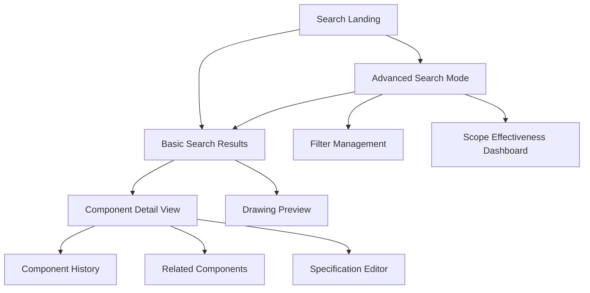
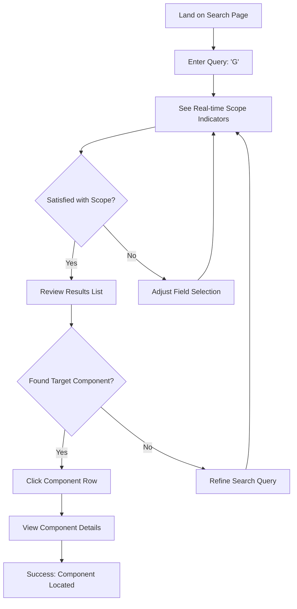
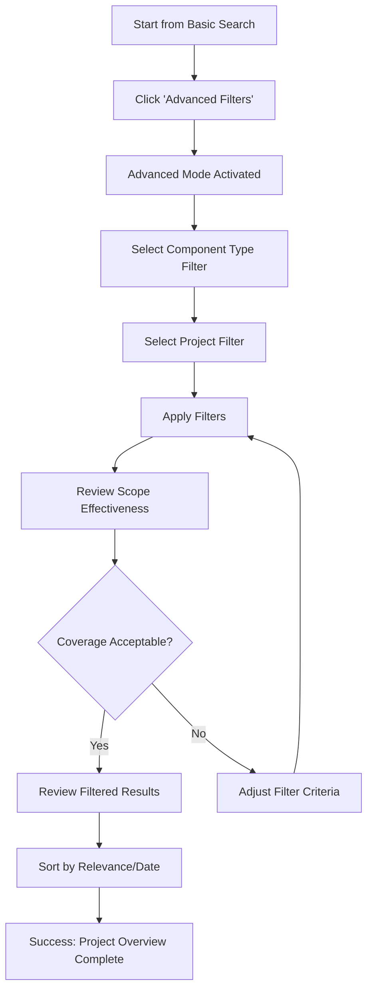

# Engineering Drawing Index System UI/UX Specification

This document defines the user experience goals, information architecture, user flows, and visual design specifications for Engineering Drawing Index System's user interface. It serves as the foundation for visual design and frontend development, ensuring a cohesive and user-centered experience.

## Overall UX Goals & Principles

### Target User Personas

**Primary: Railroad Bridge Engineer (80% of usage)**
- **Context:** Experienced professionals locating specific piece marks under time pressure
- **Needs:** Speed, precision, comprehensive search with minimal cognitive overhead
- **Technical Comfort:** High - comfortable with technical terminology and keyboard shortcuts
- **Success Metric:** Can locate any indexed component within 30 seconds

**Secondary: Project Manager (15% of usage)**  
- **Context:** Coordinates multiple teams, needs project-level oversight and progress tracking
- **Needs:** Clear visual indicators, filtering capabilities, exportable results
- **Technical Comfort:** Medium - appreciates guided workflows
- **Success Metric:** Can generate project component reports within 2 minutes

**Tertiary: Quality Assurance Engineer (5% of usage)**
- **Context:** Validates component specifications and traces relationships
- **Needs:** Confidence indicators, detailed component data, audit trails
- **Technical Comfort:** High - requires data accuracy over speed
- **Success Metric:** Can verify component accuracy with 95% confidence

### Measurable Usability Goals

1. **Search Efficiency Target:** Average time to first relevant result < 10 seconds
2. **Scope Transparency:** Users can identify search coverage within 3 seconds of query entry
3. **Progressive Disclosure Success:** 90% of searches completed using basic interface (no advanced filters)
4. **Error Prevention:** < 5% of searches result in "no results" due to incorrect field selection
5. **Performance Benchmark:** Interface remains responsive (< 300ms) during real-time search feedback

### Design Principles (Validated with Technical Team)

1. **Search-First Architecture** - Every interface decision prioritizes the core search workflow
   - *Implementation Note:* Requires careful frontend state management and API design

2. **Measured Progressive Disclosure** - Start with 80% use case, reveal advanced features on-demand
   - *Technical Requirement:* Conditional rendering with performance optimization

3. **Immediate Yet Performant Feedback** - Balance real-time updates with system performance
   - *Implementation Strategy:* Debounced queries + cached scope calculations

4. **Validated Transparency** - Show search scope with verified accuracy metrics
   - *Backend Requirement:* Search analytics API with accuracy validation

5. **Enhanced Familiar Patterns** - Leverage established search paradigms with engineering-specific enhancements
   - *Maintenance Strategy:* Build on standard libraries, minimize custom components

### Implementation Priorities

**Phase 1: Core Search (Sprint 1-2)**
- Basic search with real-time results
- Field selection (piece marks, types, descriptions)
- Simple scope indicators

**Phase 2: Progressive Enhancement (Sprint 3-4)**  
- Advanced filters (project, drawing type)
- Detailed scope effectiveness metrics
- Component detail views

**Phase 3: Mobile & Polish (Sprint 5)**
- Tablet responsiveness for field use
- Keyboard shortcuts for power users
- Performance optimization

## Information Architecture (IA)

### Site Map / Screen Inventory

### Navigation Structure

**Primary Navigation:** Single-focus search bar with contextual action buttons
- Search input field (always visible)
- Search scope toggle (piece marks/types/descriptions)  
- Filter access button (reveals advanced options)

**Secondary Navigation:** Progressive disclosure of advanced features
- Appears below primary search after query entry
- Filter chips for active selections
- Scope effectiveness metrics (collapsible)
- Sort and view options

**Breadcrumb Strategy:** Context-aware location indicators
- Search Results > [Query] > [Active Filters]
- Component Detail > [Component ID] > [Source Drawing]
- Maintains search context when drilling down into details

## User Flows

### Flow 1: Basic Component Search (Primary Engineer Workflow)

**User Goal:** Quickly locate a specific piece mark (e.g., "G" from current interface)

**Entry Points:** 
- Direct navigation to search page
- Bookmark to search page
- Navigation from other system areas

**Success Criteria:** Component found and details accessible within 30 seconds

#### Flow Diagram

#### Edge Cases & Error Handling:
- **No results found:** Clear message with suggestions to broaden field selection
- **Too many results:** Progressive refinement suggestions (add filters)
- **Ambiguous query:** Scope indicators show multiple potential matches across fields
- **System slow response:** Loading states with progress indicators
- **Invalid search characters:** Real-time validation with helpful error messages

**Notes:** This flow prioritizes speed and efficiency. The scope indicators provide immediate feedback about search coverage before users invest time reviewing results.

### Flow 2: Advanced Search with Project Filtering (Project Manager Workflow)

**User Goal:** Find all components of a specific type within a particular project

**Entry Points:**
- Basic search that needs refinement
- Direct access to advanced search mode

**Success Criteria:** Generate comprehensive project component list within 2 minutes

#### Flow Diagram

#### Edge Cases & Error Handling:
- **No projects available:** Clear message explaining data availability
- **Filter combination yields no results:** Progressive filter removal suggestions
- **Large result sets:** Pagination with performance optimization
- **Filter state confusion:** Clear indicators of active filters with easy removal

**Notes:** This flow emphasizes transparency and control. The scope effectiveness dashboard helps users understand the completeness of their search across the project.

## Wireframes & Mockups

### Primary Design Files

**Primary Design Files:** This specification serves as the foundation for detailed visual designs to be created in your preferred design tool (Figma, Sketch, etc.)

### Key Screen Layouts

#### Screen 1: Search Landing (Clean Entry Point)

**Purpose:** Eliminate decision paralysis with a single, prominent search entry point

**Key Elements:**
- Large, centered search input field with placeholder "Search piece marks, components, or descriptions"
- Subtle field selection toggles below (☑️ Piece Marks ☑️ Component Types ⬜ Descriptions)
- "🔧 Advanced Filters" link (collapsed by default)
- Recent searches suggestions (if applicable)

**Interaction Notes:** 
- Auto-focus on search input
- Real-time scope preview appears as user types
- Enter key or automatic search trigger after brief pause
- Progressive disclosure: advanced options appear only when needed

**Design File Reference:** [To be created - Search Landing Wireframe]

#### Screen 2: Basic Search Results (Progressive Enhancement)

**Purpose:** Display results with clear scope indicators and easy refinement options

**Key Elements:**
- Persistent search bar at top (user can modify query)
- Scope effectiveness panel: "Piece Marks (23) | Component Types (64) | Descriptions (0)"
- Clean results table with essential columns: Piece Mark, Type, Quantity, Drawing, Confidence
- Pagination controls
- Sort dropdown (Relevance, Alphabetical, Confidence)

**Interaction Notes:**
- Click component row to view details
- Click scope numbers to adjust field selection
- Hover states provide quick preview information
- Loading states for search refinement

**Design File Reference:** [To be created - Basic Results Wireframe]

#### Screen 3: Advanced Search Mode (On-Demand Complexity)

**Purpose:** Provide powerful filtering without overwhelming the basic interface

**Key Elements:**
- Expanded filter panel with Component Type and Project dropdowns
- Active filter chips with easy removal (X buttons)
- Enhanced scope effectiveness dashboard with coverage metrics
- "Return to Basic Search" option
- Filter presets or saved searches (future enhancement)

**Interaction Notes:**
- Smooth transition from basic search (slide down/expand animation)
- Filter changes update results in real-time
- Clear visual distinction between basic and advanced modes
- Easy path back to simplified view

**Design File Reference:** [To be created - Advanced Mode Wireframe]

#### Screen 4: Component Detail View (Context Preservation)

**Purpose:** Show comprehensive component information while maintaining search context

**Key Elements:**
- Component header with piece mark, type, and confidence score
- Tabbed sections: Overview, Dimensions, Specifications, History
- Drawing preview with component location highlighted
- "← Back to Search Results" breadcrumb
- Related components section

**Interaction Notes:**
- Breadcrumb maintains search query and filters
- Drawing preview allows zooming and panning
- Tabs provide organized access to detailed information
- Quick actions for common tasks (edit, duplicate, etc.)

**Design File Reference:** [To be created - Detail View Wireframe]

## Component Library / Design System

### Design System Approach

**Design System Approach:** Build upon Material-UI foundation with engineering-specific enhancements. Create a focused component library that prioritizes search functionality, data display, and professional engineering aesthetics. Emphasize consistency, accessibility, and maintainability over visual innovation.

### Core Components

#### Component: Search Input Enhanced

**Purpose:** Primary search entry point with real-time scope feedback and field selection

**Variants:** 
- Basic mode (clean, minimal)
- Enhanced mode (with scope indicators)
- Advanced mode (with filter access)

**States:** 
- Default, Focused, Loading, Error, Success
- Empty, Has Value, Invalid Input
- Scope indicators: Active, Inactive, Loading

**Usage Guidelines:** Always auto-focus on page load. Provide immediate visual feedback for scope coverage. Use consistent placeholder text across all instances.

#### Component: Scope Effectiveness Panel

**Purpose:** Display search coverage metrics with interactive refinement options

**Variants:**
- Compact view (single line with numbers)
- Expanded view (with coverage percentages and recommendations)
- Dashboard view (detailed analytics for advanced mode)

**States:**
- Loading, Complete, Error, Empty Results
- Interactive (clickable scope areas), Read-only

**Usage Guidelines:** Always show actual numbers, not just percentages. Use consistent color coding for effectiveness levels. Provide clear actions for scope refinement.

#### Component: Search Result Row

**Purpose:** Display component information in scannable, actionable format

**Variants:**
- Standard view (essential information)
- Detailed view (expanded information)
- Compact view (mobile-optimized)

**States:**
- Default, Hover, Selected, Loading
- High Confidence, Medium Confidence, Low Confidence
- Favorited, Recently Viewed

**Usage Guidelines:** Consistent confidence indicator placement. Clear visual hierarchy for piece mark vs. other data. Hover states reveal additional actions.

#### Component: Filter Chip

**Purpose:** Show active filters with easy removal and clear visual grouping

**Variants:**
- Standard filter (project, component type)
- Advanced filter (date range, drawing type)
- System filter (scope selection, sort order)

**States:**
- Active, Inactive, Removable, Locked
- Default, Hover, Focus

**Usage Guidelines:** Use consistent removal pattern (X button). Group related filters visually. Provide clear indication of filter hierarchy.

#### Component: Progressive Disclosure Container

**Purpose:** Manage the transition between basic and advanced search modes

**Variants:**
- Collapsed (basic mode active)
- Expanded (advanced mode active)
- Transitioning (smooth animation between states)

**States:**
- Basic Mode, Advanced Mode, Loading, Error

**Usage Guidelines:** Smooth, predictable animations. Clear visual indication of current mode. Easy path back to basic mode.

## Branding & Style Guide

### Visual Identity

**Brand Guidelines:** Professional engineering aesthetic that prioritizes clarity, precision, and trust. The visual identity should reflect the technical competence of the users while remaining approachable and efficient to use.

### Color Palette

| Color Type | Hex Code | Usage |
|------------|----------|--------|
| Primary | #1976d2 | Primary actions, search buttons, active states |
| Secondary | #424242 | Secondary text, component types, metadata |
| Accent | #2196f3 | Interactive elements, scope indicators, confidence scores |
| Success | #4caf50 | High confidence indicators, successful operations |
| Warning | #ff9800 | Medium confidence indicators, important notices |
| Error | #f44336 | Low confidence indicators, errors, critical alerts |
| Neutral | #f5f5f5, #e0e0e0, #9e9e9e | Backgrounds, borders, disabled states |

### Typography

#### Font Families
- **Primary:** Roboto (clean, technical, highly legible)
- **Secondary:** Roboto Mono (piece marks, technical identifiers)
- **Monospace:** 'Roboto Mono', 'Courier New' (code, exact specifications)

#### Type Scale

| Element | Size | Weight | Line Height |
|---------|------|--------|-------------|
| H1 | 32px | 400 (Regular) | 1.2 |
| H2 | 24px | 500 (Medium) | 1.3 |
| H3 | 20px | 500 (Medium) | 1.4 |
| Body | 16px | 400 (Regular) | 1.5 |
| Small | 14px | 400 (Regular) | 1.4 |

### Iconography

**Icon Library:** Material Design Icons (consistent with Material-UI foundation)

**Usage Guidelines:** Use outlined icons for inactive states, filled icons for active states. Maintain 24px base size for consistency. Use engineering-specific icons for component types when available.

### Spacing & Layout

**Grid System:** 8px base grid with Material-UI's 12-column responsive grid

**Spacing Scale:** 8px, 16px, 24px, 32px, 48px, 64px (consistent with Material-UI spacing)

## Accessibility Requirements

### Compliance Target

**Standard:** WCAG 2.1 AA compliance with select AAA features for critical search functionality

### Key Requirements

**Visual:**
- Color contrast ratios: 4.5:1 minimum for normal text, 3:1 for large text and UI components
- Focus indicators: High-contrast focus rings (2px solid #1976d2) visible on all interactive elements
- Text sizing: Support browser zoom up to 200% without horizontal scrolling

**Interaction:**
- Keyboard navigation: Complete interface accessible via keyboard with logical tab order
- Screen reader support: Proper ARIA labels, landmarks, and live regions for search results
- Touch targets: Minimum 44px tap targets for mobile/tablet use

**Content:**
- Alternative text: Descriptive alt text for all drawing previews and confidence indicators
- Heading structure: Logical H1-H6 hierarchy for screen reader navigation
- Form labels: Clear, descriptive labels for all search inputs and filters

### Testing Strategy

**Multi-Modal Testing Approach:**
- **Automated Testing:** axe-core integration in test suite for continuous accessibility validation
- **Screen Reader Testing:** Manual testing with NVDA (Windows) and VoiceOver (Mac) for search workflows
- **Keyboard Navigation Testing:** Complete interface navigation using only keyboard
- **Color Contrast Validation:** Automated contrast checking for all color combinations
- **Zoom Testing:** Interface usability testing at 200% browser zoom
- **Mobile Accessibility:** Testing with mobile screen readers and switch control

## Responsiveness Strategy

### Breakpoints

| Breakpoint | Min Width | Max Width | Target Devices |
|------------|-----------|-----------|----------------|
| Mobile | 320px | 767px | Phones, small tablets in portrait |
| Tablet | 768px | 1023px | iPads, Android tablets, laptop touchscreens |
| Desktop | 1024px | 1439px | Standard monitors, laptops |
| Wide | 1440px | - | Large monitors, ultrawide displays |

### Adaptation Patterns

**Layout Changes:** 
- **Mobile:** Single-column layout with stacked search elements, simplified results table with card-based layout
- **Tablet:** Two-column layout with sidebar for filters, condensed table with essential columns
- **Desktop:** Full multi-column layout with all features visible, optimized for keyboard workflows
- **Wide:** Enhanced multi-column with expanded detail panels and side-by-side comparisons

**Navigation Changes:**
- **Mobile:** Hamburger menu for navigation, modal overlays for advanced filters, bottom sheet for scope indicators
- **Tablet:** Collapsible sidebar navigation, slide-over panels for advanced features
- **Desktop:** Fixed navigation with progressive disclosure, inline filter panels
- **Wide:** Persistent navigation and filter panels, multi-panel layouts

**Content Priority:**
- **Mobile:** Focus on basic search with progressive disclosure, essential result columns only (piece mark, type, confidence)
- **Tablet:** Moderate detail level with smart truncation, swipe gestures for additional information
- **Desktop:** Full detail level with complete information hierarchy
- **Wide:** Enhanced detail with preview panes and expanded metadata

**Interaction Changes:**
- **Mobile:** Touch-optimized controls (44px minimum), swipe gestures, pull-to-refresh
- **Tablet:** Mixed touch and keyboard support, drag-and-drop for filters, multi-touch gestures
- **Desktop:** Keyboard-first optimization, hover states, right-click context menus
- **Wide:** Advanced keyboard shortcuts, multi-panel drag operations, simultaneous workflows

## Animation & Micro-interactions

### Motion Principles

**Functional Over Decorative:** All animations serve a clear purpose - providing feedback, indicating state changes, or guiding attention. No purely decorative motion that could slow down professional workflows.

**Performance-First:** Animations must maintain 60fps performance and include reduced-motion preferences for accessibility and professional environments.

**Immediate Feedback:** Every user action receives instant visual acknowledgment before any network operations begin.

**Spatial Consistency:** Animations respect the logical relationship between interface elements and maintain spatial continuity during transitions.

### Key Animations

- **Search Input Focus:** Subtle border color transition (#e0e0e0 → #1976d2) with gentle glow effect (Duration: 200ms, Easing: ease-out)

- **Scope Indicator Updates:** Real-time number changes with subtle scale bounce for emphasis (Duration: 300ms, Easing: cubic-bezier(0.68, -0.55, 0.265, 1.55))

- **Progressive Disclosure Expansion:** Smooth height transition for advanced filter panel with staggered reveal of individual controls (Duration: 400ms, Easing: ease-in-out)

- **Search Results Loading:** Skeleton placeholder animation with subtle shimmer effect while results load (Duration: 1.5s loop, Easing: ease-in-out)

- **Filter Chip Addition/Removal:** Slide-in from left with scale emphasis, fade-out with slight scale down (Duration: 250ms, Easing: ease-out)

- **Component Row Hover:** Subtle background color shift and slight elevation increase for clear interaction feedback (Duration: 150ms, Easing: ease-out)

- **Confidence Score Updates:** Color transition with brief scale emphasis when confidence values change (Duration: 300ms, Easing: ease-out)

- **Sort Order Changes:** Gentle list item reordering with position transitions maintaining visual continuity (Duration: 500ms, Easing: ease-in-out)

## Change Log

| Date | Version | Description | Author |
|------|---------|-------------|--------|
| 2025-08-21 | 1.0 | Initial specification for search page redesign | Sally (UX Expert) |
| 2025-08-21 | 1.1 | Updated with cross-functional team feedback | Sally (UX Expert) |
