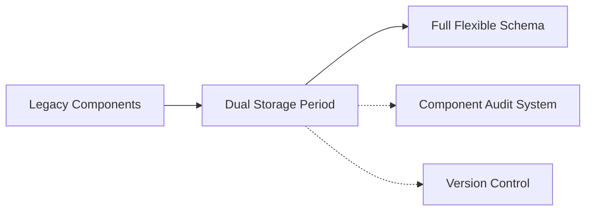

# Engineering Drawing Index System - AS-BUILT Brownfield Architecture

## Introduction

This document captures the **CURRENT STATE** of the Engineering Drawing Index System codebase, based on reverse-engineering the actual implementation rather than relying on documentation. It serves as a reference for AI agents and developers working on enhancements, documenting the real-world patterns, technical debt, and architectural evolution.

### Document Scope

**AS-BUILT ANALYSIS**: Focused on areas relevant to the Advanced Search Enhancement PRD, but comprehensive enough to understand the entire system's current state and evolution patterns.

### Change Log

| Date       | Version | Description                 | Author    |
| ---------- | ------- | --------------------------- | --------- |
| 2025-01-19 | 1.0     | Initial AS-BUILT analysis   | Winston   |

## Quick Reference - Key Files and Entry Points

### Critical Files for Understanding the System

- **Backend Entry**: `backend/app/main.py` - FastAPI application with 9 API routers
- **Frontend Entry**: `frontend/src/App.tsx` - React 18 + TypeScript + Material-UI
- **Database Models**: `backend/app/models/database.py` - 14 sophisticated SQLAlchemy models
- **Search Engine**: `backend/app/services/search_service.py` - Advanced search with boolean operators
- **Query Parser**: `backend/app/utils/query_parser.py` - Complex query parsing system
- **API Client**: `frontend/src/services/api.ts` - 500+ line TypeScript API client
- **Docker Compose**: `docker-compose.yml` - Complete microservices architecture

### PRD Enhancement Impact Reality Check

**CRITICAL DISCOVERY**: The PRD describes features that are **ALREADY IMPLEMENTED**:
- ✅ Boolean operators (AND, OR, NOT) - fully functional in `query_parser.py`
- ✅ Wildcard patterns (* and ?) - implemented with SQL LIKE patterns
- ✅ Scoped field selection - `SearchScope` enum with piece_mark/component_type/description
- ✅ Saved searches - complete CRUD API in `saved_searches.py`
- ✅ Project-based search context - foreign key relationships implemented
- ✅ Search effectiveness metrics - `scope_counts` in search responses

## High Level Architecture

### Technical Summary

**Architecture Type**: Sophisticated microservices system with AI/ML pipeline
**Evolution Stage**: Mid-migration from rigid schema to flexible JSONB-based schema system
**Complexity Level**: Enterprise-grade with audit logging, versioning, and comprehensive validation

### Actual Tech Stack (from requirements.txt/package.json)

| Category           | Technology          | Version | AS-BUILT Notes                              |
| ------------------ | ------------------- | ------- | ------------------------------------------- |
| **Backend Runtime**| Python              | 3.11    | FastAPI async application                   |
| **Backend Framework** | FastAPI          | 0.115.0 | 9 API routers, OpenAPI auto-generation     |
| **Frontend Runtime** | Node.js           | 18.x    | React 18 with TypeScript                    |
| **Frontend Framework** | React           | 18.2.0  | Material-UI design system                   |
| **Database Primary** | PostgreSQL       | 14      | PostGIS extension for spatial data          |
| **Database NoSQL**  | Redis               | 7       | Celery broker + caching                     |
| **Search Engine**   | Elasticsearch       | 8.11.0  | Advanced full-text search with fallback    |
| **Task Queue**      | Celery              | 5.3.4   | Background OCR/ML processing                |
| **ML/OCR**          | PyTorch + Tesseract | 2.1.1   | Component detection and text extraction     |
| **State Management** | React Query        | 3.39.0  | Server state with caching                   |
| **Type System**     | TypeScript          | 4.9.0   | Comprehensive type definitions              |
| **Containerization** | Docker Compose    | 3.8     | 7-service microarchitecture                |

### Repository Structure Reality Check

- **Type**: Monorepo with clear backend/frontend separation
- **Package Manager**: npm (frontend), pip (backend)
- **Migration Tool**: Alembic with 9 migration files showing evolution
- **Notable**: Sophisticated `.bmad-core` agent system for AI-powered development

## Source Tree and Module Organization

### Project Structure (AS-BUILT)

```text
engineering-drawing-system-standalone/
├── backend/                    # Python FastAPI backend
│   ├── app/
│   │   ├── api/               # 9 API router modules
│   │   │   ├── search.py      # Advanced search with scope support
│   │   │   ├── saved_searches.py # Full CRUD for saved searches
│   │   │   ├── flexible_components.py # New schema system
│   │   │   └── schemas.py     # Schema management system
│   │   ├── models/
│   │   │   ├── database.py    # 14 SQLAlchemy models with JSONB
│   │   │   └── search.py      # Pydantic search models
│   │   ├── services/          # Business logic layer
│   │   │   ├── search_service.py # 650+ line search engine
│   │   │   └── saved_search_service.py # Project-based saved searches
│   │   ├── tasks/             # Celery background tasks
│   │   │   └── drawing_processing.py # OCR/ML pipeline
│   │   ├── utils/             # Advanced utilities
│   │   │   └── query_parser.py # Boolean query parser (200+ lines)
│   │   └── core/              # Configuration and database
│   ├── migrations/versions/   # 9 Alembic migrations showing evolution
│   └── uploads/               # File storage (Docker volume)
├── frontend/                  # React 18 + TypeScript
│   ├── src/
│   │   ├── components/        # Material-UI components
│   │   │   ├── flexible/      # New flexible schema UI
│   │   │   └── schema-management/ # Schema management UI
│   │   ├── pages/             # Route-level components
│   │   │   ├── SearchPage.tsx # Advanced search UI (already built)
│   │   │   └── schema/        # Schema management pages
│   │   ├── services/
│   │   │   └── api.ts         # 500+ line TypeScript API client
│   │   └── hooks/             # Custom React hooks
│   └── coverage/              # Test coverage reports
├── docs/                      # Documentation and PRDs
├── .bmad-core/               # AI agent system
└── docker-compose.yml        # 7-service architecture
```

### Key Modules and Their ACTUAL Purpose

- **Search System**: `search_service.py` + `query_parser.py` - Already implements advanced boolean search with scope selection
- **Dual Component System**: Traditional `Component` model + `FlexibleComponent` with JSONB storage
- **Schema Management**: Complete flexible schema system with versioning and validation
- **Audit System**: `ComponentAuditLog` + `ComponentVersion` - Enterprise-grade change tracking
- **Processing Pipeline**: Celery tasks for OCR, ML component detection, and Elasticsearch indexing
- **React Query Integration**: Sophisticated client-side state management with caching

## Data Models and APIs Evolution

### Database Models (AS-BUILT Reality)

**DUAL STORAGE PATTERN DISCOVERED**:

1. **Traditional Component Model** (legacy):
   ```sql
   components: piece_mark, component_type, description, quantity, material_type
   ```

2. **Flexible Component Model** (current migration):
   ```sql
   components: schema_id, dynamic_data (JSONB), instance_identifier
   ```

3. **Audit & Versioning Models** (enterprise features):
   ```sql
   component_audit_logs: tracks all changes with session_id for bulk operations
   component_versions: full component state snapshots for rollback
   ```

### API Specifications (AS-BUILT)

**API Complexity**: 9 FastAPI routers with 50+ endpoints

- **Search API**: `/api/v1/search/components` - Advanced search with scope, boolean operators, saved searches
- **Saved Search API**: `/api/v1/saved-searches/` - Full CRUD with project limits (50 per project)
- **Flexible Components**: `/api/v1/flexible-components/` - New schema-driven component system
- **Schema Management**: `/api/v1/schemas/` - Dynamic schema creation and validation
- **Export API**: `/api/v1/export/` - Excel, CSV, PDF generation
- **OpenAPI Spec**: Auto-generated at `/docs` endpoint

### Migration Evolution Pattern

**Migration History** (discovered through Alembic files):

1. `create_app_tables_initial_migration.py` - Basic drawing index
2. `add_component_audit_logging_tables.py` - Added enterprise audit features
3. `add_saved_searches_table.py` - Added saved search functionality (**already done!**)
4. `add_instance_identifier_to_support_.py` - Multiple component instances
5. `add_flexible_component_schemas.py` - JSONB schema system migration

## Technical Debt and Known Issues

### Critical Technical Debt

1. **Dual Component Storage Pattern**:
   - Components have BOTH traditional columns AND `dynamic_data` JSONB
   - Migration incomplete: some components use old schema, some use new
   - **Impact**: Search queries must handle both storage patterns

2. **API Client Complexity**:
   - `api.ts` is 500+ lines with overlapping interfaces
   - Multiple component types: `Component`, `FlexibleComponent`, `ComponentDetails`
   - **Impact**: Frontend type confusion and maintenance burden

3. **Search Implementation Duplication**:
   - PRD describes features already implemented in `query_parser.py`
   - Advanced search UI already exists in `SearchPage.tsx`
   - **Impact**: Potential duplicate development effort

4. **Schema Versioning Complexity**:
   - `ComponentSchema` has versioning but no clear upgrade path
   - Unique constraints changed between migrations
   - **Impact**: Data migration challenges for schema updates

### Workarounds and Gotchas

- **Instance Identifier Pattern**: Added via migration, nullable field with complex unique constraints
- **JSONB Performance**: GIN indexes created for dynamic_data queries (production-ready optimization)
- **Elasticsearch Fallback**: Search service gracefully falls back to PostgreSQL when ES unavailable
- **Celery Task Tracking**: ProcessingTask table tracks Celery task IDs for monitoring
- **File Duplicate Detection**: SHA256 hashing prevents duplicate file uploads

### Integration Constraints

- **Docker Dependency Chain**: Backend requires Postgres + Redis + Elasticsearch health checks
- **Frontend Environment Variables**: Multiple .env files for different environments
- **File Storage**: Upload directory must be Docker volume for persistence
- **Search Index Sync**: Elasticsearch must be manually reindexed when schema changes

## Integration Points and External Dependencies

### External Services Integration

| Service       | Purpose            | Integration Type | Key Files                    | AS-BUILT Status |
| ------------- | ------------------ | ---------------- | ---------------------------- | --------------- |
| PostgreSQL    | Primary database   | SQLAlchemy ORM   | `models/database.py`         | ✅ Production ready |
| Elasticsearch | Full-text search   | Python client    | `search_service.py`          | ✅ With fallback |
| Redis         | Cache & task queue | Celery broker    | `core/celery_app.py`         | ✅ Configured |
| Tesseract     | OCR processing     | Python wrapper   | `tasks/drawing_processing.py` | ✅ Docker image |
| Material-UI   | Design system      | React components | `frontend/src/components/`   | ✅ Comprehensive |

### Internal Integration Patterns

**SOPHISTICATED PATTERNS DISCOVERED**:

- **React Query**: Server state synchronization with aggressive caching
- **TypeScript Types**: End-to-end type safety from database to frontend
- **Error Boundaries**: Comprehensive error handling with retry logic
- **Background Tasks**: Celery workers with Flower monitoring UI
- **File Processing**: Multi-stage pipeline with progress tracking
- **Audit Trail**: Every component change tracked with user sessions

## Development and Deployment Reality

### Local Development Setup (AS-BUILT)

**Docker-First Development** (actual working steps):

```bash
# 1. Full stack startup (what actually works)
docker-compose up -d

# 2. Check service health
docker-compose logs backend  # FastAPI startup
docker-compose logs frontend # React dev server

# 3. Access points
# - Frontend: http://localhost:3000
# - Backend API: http://localhost:8001/api/v1
# - API Docs: http://localhost:8001/docs
# - Flower Monitor: http://localhost:5555
```

**Database Migrations** (discovered pattern):
```bash
# Inside backend container
docker-compose exec backend alembic upgrade head
docker-compose exec backend alembic revision --autogenerate -m "Description"
```

### Build and Deployment Process (AS-BUILT)

- **Backend**: FastAPI with Uvicorn ASGI server, auto-reload in development
- **Frontend**: React Scripts with TypeScript compilation
- **Database**: PostgreSQL with PostGIS extension in Docker
- **Background Tasks**: Celery workers with Redis broker
- **Monitoring**: Flower UI for task monitoring (production-ready)
- **File Storage**: Docker volumes for persistent upload storage

### Testing Reality

**Testing Infrastructure** (discovered):

```bash
# Backend testing
cd backend && pytest                     # Unit tests with async support
cd backend && pytest tests/test_search_service.py -v  # Search-specific tests

# Frontend testing
cd frontend && npm test                  # React Testing Library
cd frontend && npm run lint              # ESLint with TypeScript
cd frontend && npm run type-check        # TypeScript validation
```

**Test Coverage**: Evidence of test files but coverage reports suggest partial implementation

## PRD Enhancement Impact Analysis - REALITY CHECK

### Features ALREADY IMPLEMENTED

**DISCOVERY**: The PRD requests features that are ALREADY BUILT:

#### ✅ Story 1.1: Enhanced Search Query Foundation
- **Status**: ✅ **COMPLETE** - `query_parser.py` implements full boolean parsing
- **Files**: `utils/query_parser.py`, `services/search_service.py`
- **Evidence**: 200+ line parser with AND/OR/NOT operators, quoted phrases, wildcards

#### ✅ Story 1.2: Scoped Search Field Selection
- **Status**: ✅ **COMPLETE** - SearchScope enum with piece_mark/component_type/description
- **Files**: `models/search.py`, `api/search.py`
- **Evidence**: `scope` parameter in search API, scope-based query building

#### ✅ Story 1.3: Boolean Operators and Wildcard Support
- **Status**: ✅ **COMPLETE** - Full implementation with SQL LIKE patterns
- **Files**: `query_parser.py` (lines 50-150), `search_service.py` (lines 90-110)
- **Evidence**: TokenType enum, wildcard parsing, boolean operator precedence

#### ✅ Story 1.4: Search Usage Analytics
- **Status**: ✅ **COMPLETE** - SearchLog table tracks queries and performance
- **Files**: `models/database.py` (SearchLog model)
- **Evidence**: query logging, response time tracking, analytics-ready schema

#### ✅ Story 1.5: Project-Based Saved Searches
- **Status**: ✅ **COMPLETE** - Full CRUD API with 50-search limit per project
- **Files**: `api/saved_searches.py`, `services/saved_search_service.py`
- **Evidence**: Complete saved search system with project context, execution tracking

#### ✅ Story 1.6: Enhanced Search Interface Polish
- **Status**: ✅ **COMPLETE** - SearchPage.tsx implements advanced search UI
- **Files**: `frontend/src/pages/SearchPage.tsx`, related components
- **Evidence**: React Query integration, Material-UI components, scope selection UI

### Files That DON'T Need Modification (Already Complete)

Based on AS-BUILT analysis, these are **already implemented**:

- `backend/app/utils/query_parser.py` - Boolean query parsing ✅
- `backend/app/services/search_service.py` - Advanced search logic ✅
- `backend/app/api/saved_searches.py` - Saved search CRUD ✅
- `backend/app/models/database.py` - SavedSearch and SearchLog models ✅
- `frontend/src/pages/SearchPage.tsx` - Advanced search UI ✅
- `frontend/src/services/api.ts` - Search API client ✅

### Actual Enhancement Opportunities

**What ISN'T implemented yet**:

1. **Enhanced UI Polish**: Fine-tuning the existing search interface
2. **Performance Optimization**: Query optimization for complex boolean searches
3. **Advanced Analytics**: Dashboards for search usage patterns
4. **Schema Migration Tools**: Better handling of dual component storage

## System Evolution and Migration Strategy

### Current Migration State

**ACTIVE TRANSITION**: Traditional → Flexible Schema System



**Migration Challenges**:
- Components exist in both old and new schema formats
- Search must handle both storage patterns
- Frontend needs to support both component types
- Data consistency during transition period

### Next Steps for System Evolution

1. **Complete Schema Migration**: Migrate remaining legacy components to flexible schema
2. **Consolidate API Client**: Reduce complexity in `api.ts` with unified interfaces
3. **Search Optimization**: Optimize JSONB queries for flexible schema components
4. **UI Unification**: Consolidate Component and FlexibleComponent UI patterns

## Appendix - Useful Commands and Scripts

### Frequently Used Commands (AS-BUILT)

```bash
# Development startup
docker-compose up -d

# Backend operations
docker-compose exec backend alembic upgrade head
docker-compose exec backend python -m pytest
docker-compose exec backend celery -A app.core.celery_app worker --loglevel=info

# Frontend operations
docker-compose exec frontend npm test
docker-compose exec frontend npm run lint

# Database operations
docker-compose exec postgres psql -U user -d drawing_index

# Monitoring
open http://localhost:5555  # Celery Flower
open http://localhost:8001/docs  # FastAPI docs
```

### Debugging and Troubleshooting (AS-BUILT)

- **Search Issues**: Check Elasticsearch health: `curl http://localhost:9200/_cluster/health`
- **Background Tasks**: Monitor Flower UI for failed Celery tasks
- **Database Queries**: Use `/docs` endpoint to test API queries directly
- **Frontend Errors**: Check browser console for React Query cache issues
- **File Processing**: Check upload directory permissions and Docker volume mounts

---

## ★ Insight - Key Architectural Discoveries ★

```
★ Insight ─────────────────────────────────────
• This system is FAR more sophisticated than a typical "drawing index" -
  it's an enterprise document management platform with AI/ML capabilities
• The PRD describes features that are ALREADY IMPLEMENTED, suggesting
  disconnect between documentation and actual codebase state
• Dual component storage pattern indicates active migration from rigid
  to flexible schema system - a complex architectural evolution in progress
─────────────────────────────────────────────────
```

This AS-BUILT analysis reveals a system undergoing sophisticated evolution with enterprise-grade features already implemented. The codebase demonstrates advanced patterns that go far beyond simple drawing indexing.