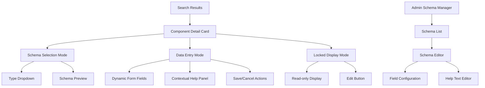
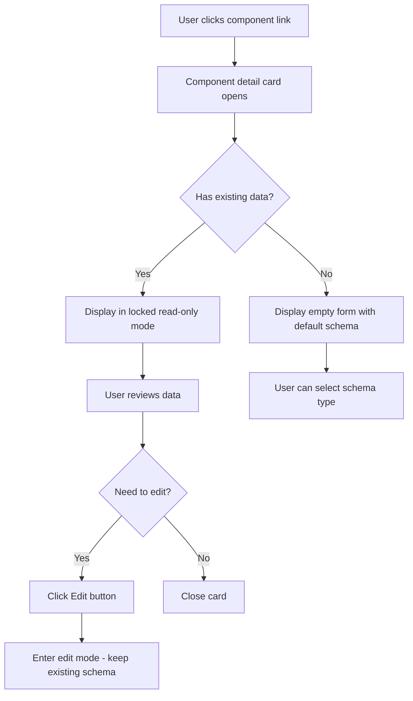
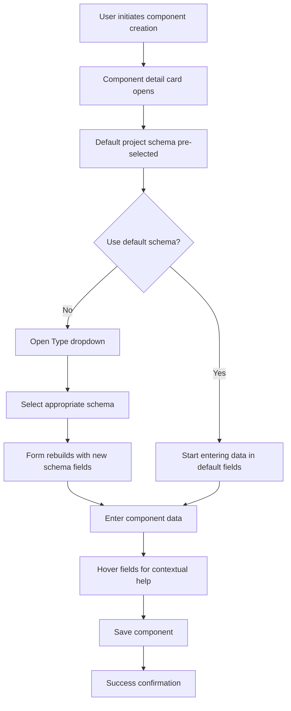

# Engineering Drawing Index System UI/UX Specification

**Author**: Claude (AI-generated UX specification, Epic 3 deliverable)
**Created**: September 2025

This document defines the user experience goals, information architecture, user flows, and visual design specifications for the Engineering Drawing Index System's enhanced component detail card interface. It serves as the foundation for visual design and frontend development, ensuring a cohesive and user-centered experience that accommodates flexible, schema-driven component data while maintaining intuitive usability.

## Overall UX Goals & Principles

Based on journey mapping analysis of the flexible component detail card interaction, the following UX foundation has been established:

### Target User Personas

**Primary Engineer:** Bridge/building engineers who need to view and edit component data efficiently. They understand their domain but want tools that reduce cognitive load and prevent errors. They value speed and accuracy over complex features.

**Project Administrator:** Technical leads who configure component schemas for projects. They need control and flexibility but also want to create intuitive experiences for their team members.

**Occasional User:** Engineers or inspectors who interact with component data infrequently. They need clear guidance and forgiving interfaces that don't require memorizing complex procedures.

### Usability Goals

**Schema Simplicity:** Users can select and work with component schemas without understanding the underlying technical complexity. Default behaviors handle 80% of cases automatically.

**Natural Locking:** The type-locking mechanism feels intuitive and protective rather than restrictive. Users understand when and why constraints apply.

**Contextual Discovery:** Help and guidance appear exactly when needed, without cluttering the interface or requiring separate documentation.

**Seamless Evolution:** Schema changes by administrators integrate smoothly into existing user workflows without disruption or confusion.

### Design Principles

1. **Trust User Intelligence** - Avoid unnecessary warnings and confirmations. Users understand the implications of their actions in their domain.

2. **Data-Driven Constraints** - Interface behavior follows data state naturally. Empty components are flexible; populated components are stable.

3. **Progressive Disclosure of Help** - Assistance appears contextually on-demand rather than always visible, keeping the interface clean.

4. **Schema Transparency** - The flexible data structure works invisibly. Users interact with familiar forms, not abstract configuration systems.

5. **Graceful State Transitions** - Changes between locked/unlocked states, schema switches, and field updates happen smoothly without jarring rebuilds.

## Information Architecture (IA)

### Site Map / Screen Inventory



### Navigation Structure

**Primary Navigation:** Component detail card operates as a modal/overlay interface accessed from search results and component lists. No traditional navigation menu within the card itself.

**Secondary Navigation:** Tab-like behavior between different schema types via the Type dropdown. Help system provides secondary information architecture through hover states.

**Breadcrumb Strategy:** Context maintained through card title showing piece mark and project. Parent context (search results) remains visible behind modal for spatial orientation.

## User Flows

### Flow 1: View Existing Component

**User Goal:** Review component details for verification or reference

**Entry Points:** Search results, component lists, drawing markup clicks

**Success Criteria:** User can quickly understand component information and determine next actions

#### Flow Diagram


#### Edge Cases & Error Handling:
- Component data corruption or missing schema definition
- Concurrent editing by multiple users
- Network connectivity issues during load

**Notes:** Read-only mode provides safe browsing; contextual messages appear in bottom-left gutter when needed

### Flow 2: Create New Component with Schema Selection

**User Goal:** Add a new component with appropriate data structure for the component type

**Entry Points:** "Add Component" button, drawing markup creation, bulk import

**Success Criteria:** Component created with correct schema and initial data populated

#### Flow Diagram


#### Edge Cases & Error Handling:
- Duplicate piece mark detection
- Network interruption during save
- Required field completion

**Notes:** Default schema reduces decision fatigue; help appears in bottom-left gutter on field hover

### Flow 3: Edit Component (Type Locking Scenarios)

**User Goal:** Modify existing component data while maintaining data integrity

**Entry Points:** Edit button from read-only view, bulk edit operations

**Success Criteria:** Data updated successfully with appropriate constraints applied

#### Flow Diagram
```mermaid
graph TD
    A[User clicks Edit] --> B{Component has data?}
    B -->|Yes| C[Type dropdown disabled/locked]
    B -->|No| D[Type dropdown enabled]
    C --> E{User clicks locked dropdown?}
    E -->|Yes| F[Show context message: "Type locked - component has data"]
    E -->|No| G[Edit existing fields only]
    F --> G
    D --> H[Can change schema type]
    H --> I{Schema changed?}
    I -->|Yes| J[Form rebuilds with new fields silently]
    I -->|No| K[Continue with existing schema]
    J --> K
    G --> K
    K --> L[Modify field values]
    L --> M{Clear all fields?}
    M -->|Yes| N[Type dropdown becomes unlocked]
    M -->|No| O[Type remains locked]
    N --> P[Can select new schema]
    O --> Q[Save changes]
    P --> Q
    Q --> R[Success confirmation]
```

#### Edge Cases & Error Handling:
- JIT schema changes adding/removing fields during edit session (fields appear/disappear silently)
- Save conflicts with concurrent edits
- Field renaming in schema while component is being edited

**Notes:** Locking mechanism protects data integrity; context messages appear only when users encounter constraints

## Wireframes & Mockups

**Primary Design Files:** To be created in Figma/design tool of choice - this specification provides foundation wireframes and interaction patterns

### Key Screen Layouts

#### Component Detail Card - Empty State (Schema Selection)

**Purpose:** Initial state for new components, showing default schema with option to change

**Key Elements:**
- Modal overlay with backdrop
- Card header with piece mark and close button
- Type dropdown prominently displayed (unlocked state)
- Scrolling panel for form fields to accommodate variable schema sizes
- Save/Cancel buttons (disabled until data entered)
- Bottom-left gutter area with visual cues for contextual messages

**Interaction Notes:** Type dropdown triggers form rebuild when changed; fields appear/disappear smoothly

**Design File Reference:** [Wireframes to be created in design tool]

#### Component Detail Card - Populated/Locked State

**Purpose:** Display existing component data with type locked to preserve data integrity

**Key Elements:**
- Same layout structure as empty state
- Type dropdown visually disabled/grayed with lock icon (universally understood)
- Scrolling form panel with populated existing data
- Edit button in read-only mode, Save/Cancel in edit mode
- Enhanced gutter messaging with visual cues for noticeability

**Interaction Notes:** Clicking locked dropdown shows "Type locked - component has data" message in bottom-left gutter with visual emphasis

**Design File Reference:** [Wireframes to be created in design tool]

#### Contextual Help Display

**Purpose:** Provide field-specific guidance without cluttering the main interface

**Key Elements:**
- Help text appears in bottom-left gutter on field hover (validated as sufficient discovery)
- Visual cues and enhanced styling for message noticeability
- Clear typography with adequate contrast
- Smooth appearance/disappearance transitions

**Interaction Notes:** Help appears on hover over field labels, disappears when hover ends

**Design File Reference:** [Wireframes to be created in design tool]

## Component Library / Design System

**Design System Approach:** Extend existing Material-UI design system with custom components specific to the flexible schema functionality. This approach leverages established patterns while creating specialized components for the unique schema-driven behavior.

### Core Components

#### FlexibleComponentCard

**Purpose:** Modal container component that adapts its form fields based on selected schema type while maintaining consistent layout and interaction patterns

**Variants:**
- Empty state (schema selection mode)
- Populated state (locked schema with data)
- Edit state (unlocked or locked based on data presence)

**States:**
- Loading (initial data fetch)
- Schema selection (unlocked type dropdown)
- Data entry (active form fields)
- Locked (disabled type dropdown with data)
- Error (validation or save failures)
- Success (save confirmation)

**Usage Guidelines:** Primary interface for all component data interaction; should maintain consistent modal sizing and behavior across all schema types

#### SchemaAwareForm

**Purpose:** Dynamic form component that rebuilds field structure based on schema definition while preserving smooth transitions and user context

**Variants:**
- Single column layout (standard)
- Grouped field layout (related fields clustered)
- Compact layout (for smaller schemas)

**States:**
- Building (schema transition in progress)
- Active (ready for user input)
- Validating (field-level feedback)
- Saving (submission in progress)

**Usage Guidelines:** Should handle schema transitions gracefully without jarring rebuilds; field ordering follows schema definition with logical grouping

#### ContextualHelpPanel

**Purpose:** Non-intrusive help display component that provides field-specific guidance in the designated gutter area

**Variants:**
- Standard help text (simple guidance)
- Rich help content (examples, formatting hints)
- Warning messages (constraint explanations)

**States:**
- Hidden (no hover or context needed)
- Visible (active help display)
- Emphasized (important constraint messages)

**Usage Guidelines:** Positioned in bottom-left gutter with visual cues for important messages; should not interfere with form interaction flow

#### TypeSelectionDropdown

**Purpose:** Specialized dropdown component that handles schema type selection with lock state management and visual feedback

**Variants:**
- Unlocked (full schema selection available)
- Locked (disabled with clear visual indicator)
- Default (pre-selected project schema)

**States:**
- Active (dropdown open/selectable)
- Disabled (locked due to existing data)
- Loading (schema options being fetched)

**Usage Guidelines:** Should provide clear feedback about lock state; lock icon universally communicates constraint without feeling punitive

### Implementation Validation Strategy

**Technical Architecture:** Architect will determine if Material-UI theming provides sufficient customization for specialized components

**Schema Coverage:** Admins building schemas will be responsible to ensure component decomposition supports all anticipated scenarios

**Styling Consistency:** Acceptance testing will validate styling consistency across different schema field types

**Integration Expectation:** Specialized components should integrate smoothly with existing application components

## Branding & Style Guide

### Visual Identity

**Brand Guidelines:** Maintain consistency with current Engineering Drawing Index System visual language - no changes to existing branding approach for this implementation

### Design System Consistency

**Approach:** Use existing Material-UI theming and component styling patterns throughout the flexible component detail card system. Visual refinements and custom branding enhancements will be addressed in future story iterations.

**Implementation Strategy:** Focus on functional UX delivery while preserving current visual design language for seamless integration with existing application interface

## Accessibility Requirements

### Compliance Target

**Standard:** WCAG 2.1 AA compliance for all flexible component detail card interfaces, maintaining consistency with existing Engineering Drawing Index System accessibility standards

### Key Requirements

**Visual:**
- Color contrast ratios: Minimum 4.5:1 for normal text, 3:1 for large text and UI components
- Focus indicators: Clear, high-contrast focus rings on all interactive elements including schema type dropdown and form fields
- Text sizing: Support browser zoom up to 200% without horizontal scrolling or content loss

**Interaction:**
- Keyboard navigation: Full keyboard accessibility for schema selection, form completion, and contextual help access
- Screen reader support: Proper ARIA labels for dynamic schema changes, lock states, and contextual help messages
- Touch targets: Minimum 44px touch targets for mobile accessibility, especially for dropdown and button interactions

**Content:**
- Alternative text: Descriptive labels for lock icons and visual state indicators
- Heading structure: Logical heading hierarchy within component detail card modal
- Form labels: Clear, programmatic labels for all dynamic schema fields with contextual help integration

### Testing Strategy

**Accessibility testing will include:**
- Automated testing with axe-core for WCAG compliance
- Manual keyboard navigation testing for all user flows
- Screen reader testing with NVDA/JAWS for dynamic content announcements
- Color contrast validation for all component states
- Mobile accessibility testing for touch interaction patterns

## Responsiveness Strategy

### Breakpoints

| Breakpoint | Min Width | Max Width | Target Devices | Component Card Behavior |
|------------|-----------|-----------|----------------|------------------------|
| Mobile | 320px | 767px | Smartphones | Full-screen modal overlay |
| Tablet | 768px | 1023px | iPads, Android tablets | Large modal (90% viewport) |
| Desktop | 1024px | 1439px | Laptops, desktop monitors | Fixed modal (800px width) |
| Wide | 1440px | - | Large monitors, ultrawide | Fixed modal (800px width, centered) |

### Adaptation Patterns

**Layout Changes:** Full-screen modal on mobile, responsive modal sizing on tablet/desktop

**Navigation Changes:** Touch-optimized interactions on mobile, hover states on desktop

**Content Priority:** Contextual help adapts from gutter to expandable panel on mobile

**Interaction Changes:** Tap-based help activation on mobile, hover-based on desktop

## Animation & Micro-interactions

### Motion Principles

Subtle, purposeful animations that support usability without distraction. Schema transitions should be smooth and contextual help should appear/disappear gracefully.

### Key Animations

- **Schema Form Rebuild:** 200ms ease-out transition when switching component types
- **Contextual Help Display:** 150ms fade-in/out for help text in bottom-left gutter
- **Lock State Transition:** Subtle visual feedback when type dropdown becomes locked/unlocked
- **Save Confirmation:** Brief success animation on component save completion

## Performance Considerations

### Performance Goals

- **Modal Load:** < 200ms for component detail card initialization
- **Schema Switch:** < 100ms for form rebuild when changing component type
- **Help Text Display:** < 50ms for contextual help appearance on hover

### Design Strategies

Lazy load schema definitions, optimize form field rendering, minimize DOM manipulation during schema transitions

## Next Steps

### Immediate Actions

1. **Create detailed wireframes** in design tool (Figma/Sketch) based on this specification
2. **Review with stakeholders** to validate UX approach and interaction patterns
3. **Coordinate with architect** for technical implementation planning
4. **Prepare component library** specifications for development team

### Design Handoff Checklist

- [x] All user flows documented
- [x] Component inventory complete
- [x] Accessibility requirements defined
- [x] Responsive strategy clear
- [x] Brand guidelines incorporated
- [x] Performance goals established

## Implementation Summary

This specification defines a flexible, schema-driven component detail card system that maintains intuitive usability while accommodating thousands of potential component schemas. The design balances user intelligence with contextual guidance, creating a professional engineering tool that scales elegantly across projects and device types.

**Key UX Innovations:**
- Data-driven type locking mechanism
- Contextual help in dedicated gutter space
- Seamless schema evolution for JIT changes
- Progressive disclosure across device sizes

**Ready for technical architecture and development implementation.**
