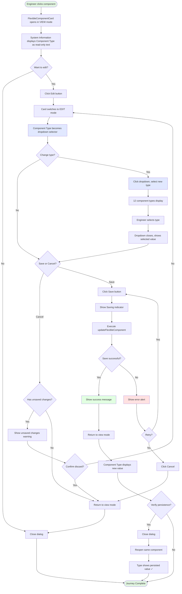

# User Journey: Component Type Display and Editing

**Story**: 3.14 - Component Type Display and Editing - Regression Fix
**Persona**: Bridge Engineer (Component Reviewer)
**Goal**: View and update component type classifications to ensure accurate component categorization

## Context

Bridge engineers need to classify structural components by type (Wide Flange, HSS, Angle, Channel, etc.) for accurate materials tracking, fabrication planning, and structural analysis. The FlexibleComponentCard is the primary interface for reviewing component details, but currently lacks the ability to view or edit component types—functionality that exists in the legacy ComponentDetailModal. This forces engineers to use workarounds or external tools, disrupting their workflow.

## Entry Point

Engineer clicks on a component from search results, drawing viewer, or component list, which opens the FlexibleComponentCard in view mode.

---

## Step-by-Step Flow

### Step 1: Open Component Details (View Mode)

**User Action:** Engineer clicks on component "B12" from search results
**System Response:** FlexibleComponentCard dialog opens showing System Information section
**Visual Cues:**
- Dialog title shows "Component Details"
- System Information card displays: Piece Mark, Instance Identifier, **Component Type**, Drawing File, Location
- Component Type shows human-readable label: "Wide Flange" (not "wide_flange")
- Type field appears as read-only text in consistent typography with other system fields

**Acceptance Criteria Verified:** AC1 (View Component Type with human-readable labels)

---

### Step 2: Enter Edit Mode

**User Action:** Engineer clicks "Edit" button in dialog footer
**System Response:** FlexibleComponentCard switches to edit mode
**Visual Cues:**
- Dialog title updates to "Edit Component"
- "Editing" chip appears next to title
- System Information fields remain read-only (Piece Mark, Instance Identifier stay as text)
- Component Type field transforms into dropdown selector
- Edit/Save/Cancel buttons appear in footer

**Acceptance Criteria Verified:** AC2 (Edit Component Type - dropdown appears)

---

### Step 3: Change Component Type

**User Action:** Engineer clicks Component Type dropdown, selects "Channel" from list
**System Response:** Dropdown expands showing all 12 component types alphabetically
**Visual Cues:**
- Dropdown menu displays with options:
  - Angle
  - Beam
  - Brace
  - Channel ← (engineer selects this)
  - Column
  - Generic
  - Girder
  - HSS
  - Plate
  - Truss
  - Tube
  - Wide Flange
- Selected value highlights in dropdown
- Dropdown closes showing "Channel" as new value
- Save button remains enabled (form is valid)

**Validation/Feedback:**
- Dropdown uses Material-UI Select pattern (matches schema selector)
- Keyboard navigation supported (arrow keys, Enter to select)
- Proper ARIA labels for screen readers

**Acceptance Criteria Verified:** AC2, AC5 (12 types from ComponentDetailModal COMPONENT_TYPES array), AC10 (Accessibility)

---

### Step 4: Save Changes

**User Action:** Engineer clicks "Save" button
**System Response:** updateFlexibleComponent mutation executes with new component_type value
**Visual Cues:**
- "Saving..." text appears on button
- Circular progress indicator shows briefly
- Success message displays: "Component updated successfully!"
- Card returns to view mode
- Component Type now displays "Channel" in System Information

**Acceptance Criteria Verified:** AC3 (Save Updates persist to database), AC7 (Integrates with existing save workflow)

---

### Step 5: Verify Persistence

**User Action:** Engineer closes dialog and reopens component B12
**System Response:** FlexibleComponentCard loads fresh data from backend
**Visual Cues:**
- Component Type displays "Channel" (persisted value)
- Updated timestamp reflects recent change

**Acceptance Criteria Verified:** AC3 (Changes persist)

---

## Decision Points

### Decision Point 1: Edit or View Only?
**Context:** Engineer opens component card
**Options:**
- **View Only**: Stay in view mode to review information → Component Type displays as read-only text
- **Edit**: Click Edit button → Component Type becomes editable dropdown

**Consequences:** Edit mode allows changes but requires Save/Cancel decision

### Decision Point 2: Which Component Type?
**Context:** Engineer must select correct structural classification
**Options:** 12 standard types (wide_flange, hss, angle, channel, plate, tube, beam, column, brace, girder, truss, generic)
**Guidance:** Engineer uses structural engineering knowledge to select appropriate type based on component geometry and purpose

### Decision Point 3: Save or Cancel Changes?
**Context:** Engineer has modified component type
**Options:**
- **Save**: Persist changes → Updates database, returns to view mode
- **Cancel**: Discard changes → Reverts to original value, returns to view mode

**Consequences:** Save persists changes permanently; Cancel loses all edits

---

## Edge Cases & Error States

### Scenario 1: Component Missing Type (Legacy Data)
**Trigger:** Component loaded from database with NULL component_type
**System Behavior:**
- View mode displays: "—" or "Not Set" in gray text
- Edit mode shows dropdown with no pre-selected value (placeholder: "Select type")
**User Experience:** Engineer sees clear indication that type is unset, can select appropriate type in edit mode

---

### Scenario 2: Save Failure (Network Error)
**Trigger:** updateFlexibleComponent mutation fails due to network issue
**System Behavior:**
- Error alert displays: "Failed to save changes. Please try again."
- Card remains in edit mode with user's changes preserved
- Save button re-enables for retry
**User Experience:** Engineer sees clear error, can retry save or cancel

---

### Scenario 3: Concurrent Edit Conflict
**Trigger:** Another user modified component type while current user editing
**System Behavior:**
- Backend returns 409 Conflict or stale data warning
- System shows: "Component was modified by another user. Refresh to see latest."
**User Experience:** Engineer must refresh to see latest data, re-apply edits if still needed

---

### Scenario 4: Cancel with Unsaved Changes
**Trigger:** Engineer clicks Cancel after changing component type
**System Behavior:**
- If changes detected (isDirty), unsaved changes warning dialog appears
- "You have unsaved changes. Are you sure you want to discard them?"
**User Experience:** Engineer gets confirmation prompt, can choose "Continue Editing" or "Discard Changes"

**Acceptance Criteria Verified:** AC7 (Existing form validation and save workflow includes dirty state checking)

---

## Success Completion

**User sees:**
- Component Type displays correctly in System Information section (view mode)
- Type shows human-readable label ("Wide Flange" not "wide_flange")
- Type matches what engineer selected from dropdown
- Updated timestamp reflects recent change

**User knows they succeeded because:**
- Success message confirmed save
- Card returned to view mode showing updated value
- Re-opening component shows persisted change

**Next actions available:**
- Close dialog to return to previous view
- Click "Edit" again to make additional changes
- Navigate to Dimensions, Specifications, or History tabs
- Click "View Drawing" to see component on drawing sheet

---

## Visual Flow

---

## Implementation Notes for Dev Team

**Key UI Elements:**

1. **View Mode (System Information Card):**
   - Add Grid item after "Instance Identifier" (line ~646 in FlexibleComponentCard.tsx)
   - Label: "Component Type" (Typography variant="body2" color="text.secondary")
   - Value: COMPONENT_TYPES label lookup (Typography variant="body1")
   - Fallback: "—" if component_type is null

2. **Edit Mode (System Information Card):**
   - Replace Typography with Controller + FormControl + Select
   - Import/define COMPONENT_TYPES array (12 types from ComponentDetailModal)
   - Pattern matches schema selector at lines 527-535
   - Dropdown size="small", fullWidth
   - MenuItem for each type with value/label

3. **Save Logic:**
   - Include component_type in formValues state
   - Add to updateMutation payload if changed
   - No additional validation needed (dropdown constrains options)

**Accessibility Requirements:**

- Dropdown aria-label: "Component type selector"
- Dropdown aria-describedby: "Select structural component classification"
- Keyboard navigation: Tab to focus, Arrow keys to navigate, Enter to select
- Screen reader announces: "Component Type, [current value], button" when focused

**Testing Scenarios:**

1. Component with existing type → displays correctly
2. Component with NULL type → shows "—" in view, empty dropdown in edit
3. Change type → dropdown opens, selection updates
4. Save → persists to backend, cache invalidates
5. Cancel with changes → shows warning, can discard or continue
6. Reopen component → shows persisted value

---

## QA Validation Checklist

- [ ] Component Type displays in view mode with human-readable label
- [ ] Component Type displays "—" for NULL values
- [ ] Edit mode shows dropdown with all 12 types
- [ ] Dropdown options match ComponentDetailModal exactly
- [ ] Selected value highlights in dropdown
- [ ] Keyboard navigation works (Tab, Arrow, Enter)
- [ ] Save button enables after type change
- [ ] Save persists to database
- [ ] Cache invalidates after save
- [ ] Success message displays after save
- [ ] Card returns to view mode after save
- [ ] Cancel shows warning if changes exist
- [ ] Cancel without changes returns to view mode immediately
- [ ] Reopen component shows persisted value
- [ ] No layout shift or spacing issues
- [ ] Screen reader announces dropdown correctly
- [ ] No console errors during interaction
- [ ] Performance: No measurable render delay

---

## Related Documentation

- **Story**: [docs/stories/backlog/story-3.14-component-type-display-restoration.md](../stories/backlog/story-3.14-component-type-display-restoration.md)
- **Reference Implementation**: ComponentDetailModal.tsx lines 335-362
- **Target Component**: frontend/src/components/flexible/FlexibleComponentCard.tsx
- **Related Story**: Story 3.15 (Schema-based type migration - future enhancement)

---

*User Journey created by Product Owner Sarah 📝*
*Last updated: 2025-10-10*
