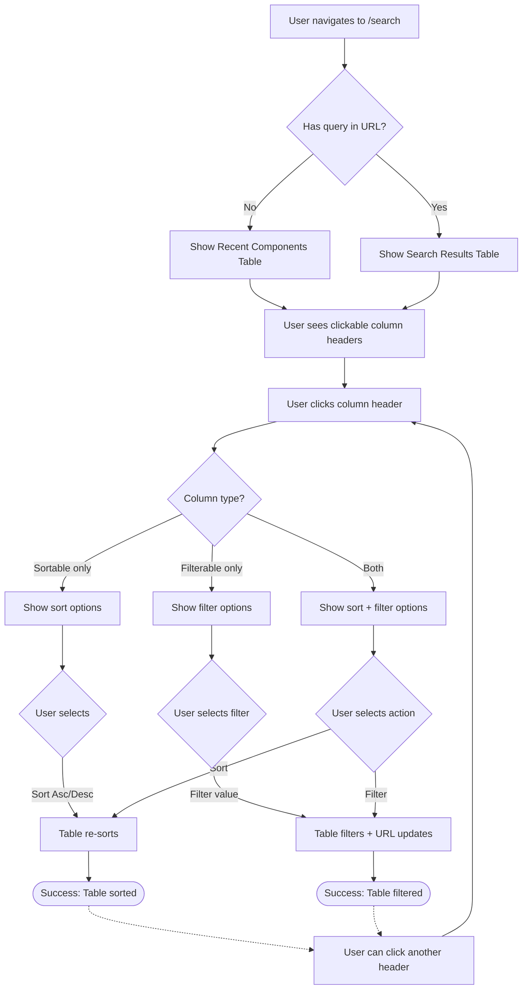

# User Journey: Excel-Style Column Filtering

**Story**: 9.1 - Search UI Column-Based Filtering
**Persona**: Railroad Bridge Engineer
**Goal**: Quickly sort and filter search results to find specific components
**Created**: 2025-01-09

---

## Context

Railroad engineers often need to find specific component types (angles, channels) across hundreds of drawing sheets. Currently, they must manually scan through long lists or repeatedly adjust search filters. This feature brings familiar Excel-like column header controls to make filtering instant and intuitive.

## Entry Point

User navigates directly to `/search` or clicks "Search Components" in the left navigation menu.

---

## Step-by-Step Flow

### Step 1: View Recent Components Table
**User Action:** Lands on search page (no query entered yet)
**System Response:** Page displays "Recent Components" table with 71 components
**Visual Cues:**
- Table shows 20 rows with columns: Piece Mark, Type, Quantity, Drawing, Project, Added, Actions
- Column headers have dropdown arrow icons (▼) indicating they're clickable
- Table is scrollable

### Step 2: Click Column Header to Access Controls
**User Action:** Clicks the "Type" column header
**System Response:** Dropdown menu opens below the header
**Visual Cues:**
- Menu shows two sections:
  - **Sort options**: "Sort Ascending ↑" and "Sort Descending ↓"
  - **Filter section**: "Filter by Type" with radio buttons
- Current selection is highlighted (e.g., "All Types" is checked)

### Step 3: Apply Filter
**User Action:** Selects "Channel (C)" radio button in the filter section
**System Response:**
- Dropdown closes automatically
- Table refreshes to show only channel components
- URL updates to include filter: `?componentType=channel`
**Visual Cues:**
- Table now shows fewer rows (only channels)
- Column header styling may indicate active filter
- Results count updates to show filtered total

### Step 4: Sort Filtered Results
**User Action:** Clicks "Piece Mark" column header, selects "Sort Ascending"
**System Response:**
- Table re-sorts filtered results alphabetically by piece mark (A-Z)
- URL updates: `?componentType=channel&sortBy=piece_mark_asc`
**Visual Cues:**
- Sort arrow icon appears next to "Piece Mark" header (↑)
- Results reorder visibly

### Step 5: Clear Filter (Optional)
**User Action:** Clicks "Type" header again, selects "All Types"
**System Response:** Filter is removed, showing all 71 components again
**Visual Cues:** Table expands back to full result set

---

## Decision Points

- **Decision**: User clicks a column header dropdown
  - **Sort Ascending**: Orders results A→Z or 0→9
  - **Sort Descending**: Orders results Z→A or 9→0
  - **Select Filter**: Narrows results to specific values (if filterable column)

- **Decision**: Which column to interact with
  - **Sortable only** (Piece Mark, Quantity, Added): Only shows sort options
  - **Filterable only** (Project): Only shows filter options with search box
  - **Both** (Type, Confidence): Shows sort AND filter options
  - **Neither** (Drawing, Actions): Header is not clickable (no dropdown)

---

## Edge Cases & Error States

### Scenario: No Results Match Filter
**Trigger:** User applies filter that has no matching components
**System Behavior:** Table shows empty state
**User Experience:** Message displays: "No components found matching your criteria. Try adjusting your filters."

### Scenario: User Navigates Away and Returns
**Trigger:** User applies filters, navigates to another page, then clicks browser back
**System Behavior:** URL parameters are preserved, filters are reapplied
**User Experience:** Table shows same filtered/sorted view as when user left

### Scenario: Invalid URL Parameters
**Trigger:** User manually edits URL with invalid filter value
**System Behavior:** Invalid parameters are ignored, defaults are applied
**User Experience:** Table shows default view (Recent Components, no filters)

---

## Success Completion

**User sees:** Table displaying exactly the components they need, sorted in the desired order

**User knows they succeeded because:**
- Results are visibly filtered (fewer rows shown)
- Sort indicator (↑ or ↓) appears next to sorted column
- URL reflects applied filters (can be bookmarked)
- Result count updates to show filtered total

**Next actions available:**
- Click any component to view details
- Apply additional filters or sorts
- Clear filters to see all results
- Perform a text search to further narrow results

---

## Visual Flow

---

## Acceptance Criteria Mapping

- [x] **AC1**: Column headers have visual indicators (dropdown arrows) when clickable
  - Covered in: Step 1 (visual cues)

- [x] **AC2**: Clicking header opens dropdown menu with sort/filter options
  - Covered in: Step 2

- [x] **AC3**: Sort ascending/descending works for sortable columns
  - Covered in: Step 4

- [x] **AC4**: Filter by component type works with radio buttons
  - Covered in: Step 3

- [x] **AC5**: URL updates with filter/sort parameters for bookmarking
  - Covered in: Step 3, Step 4

- [x] **AC6**: Filters persist across navigation (back/forward)
  - Covered in: Edge Case "User Navigates Away and Returns"

---

## Implementation Notes

**Performance**: Initial table load shows 20 components with "Load More" pagination. Filtering/sorting applies to ALL components (not just visible 20), requires API call.

**Accessibility**: Column headers are keyboard navigable (Tab), dropdowns can be opened with Enter/Space, radio buttons are standard form controls.

**Browser Compatibility**: Uses Material-UI Menu component (React), works in all modern browsers. No IE11 support needed.

---

**Story Reference**: 9.1
**Created**: 2025-01-09
**Owner**: Product Owner (PO)
