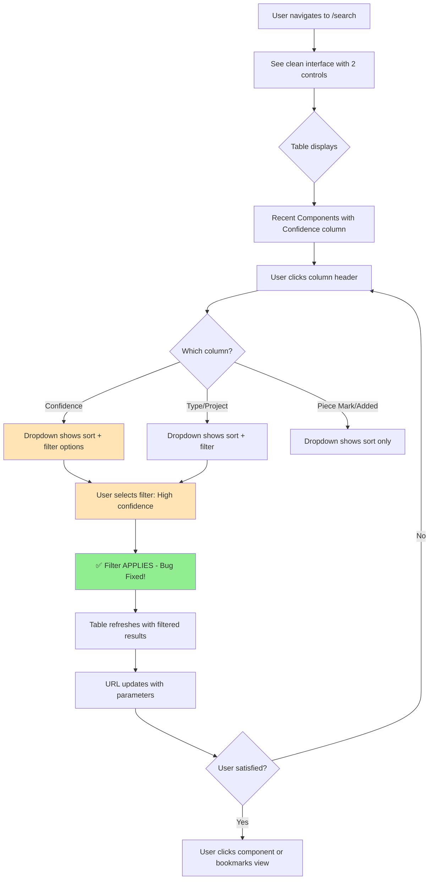

# User Journey: Search UI Refinement with Working Filters

**Story**: 9.2 - Search UI Refinement and Filter Fix
**Persona**: Railroad Bridge Engineer
**Goal**: Quickly filter search results by confidence level, component type, and project using a clean, focused interface
**Created**: 2025-01-09

---

## Context

After Story 9.1 implemented column header dropdowns, engineers found critical gaps: filters don't actually work when selected, there's no way to see component confidence scores, and the interface has redundant controls creating clutter. This refinement fixes those issues so engineers can efficiently filter hundreds of components to find exactly what they need.

## Entry Point

User navigates to `/search` or clicks "Search Components" in left navigation menu.

---

## Step-by-Step Flow

### Step 1: Land on Clean Search Page
**User Action:** Arrives at search page
**System Response:** Page displays with streamlined top controls
**Visual Cues:**
- **Only 2 controls at top:**
  1. Search text box: "Search piece marks, components, or descriptions"
  2. "Search Scope" button with filter icon
- ~~No "Sort By" dropdown~~ (removed - sorting happens via column headers)
- "Recent Components" table shows 20 entries with columns:
  - Piece Mark, Type, Drawing, Project, **Confidence** *(new!)*, Added, Actions
  - ~~Quantity column removed~~
- All sortable/filterable column headers show dropdown arrow (▼)

### Step 2: View Confidence Scores
**User Action:** Scans the new Confidence column
**System Response:** Displays confidence data for each component
**Visual Cues:**
- Each row shows colored indicator + percentage:
  - 🟢 87% (high confidence - green)
  - 🟡 62% (medium - yellow)
  - 🟠 41% (low - orange)
  - 🔴 18% (very low - red)
- User can quickly identify high-quality vs low-quality OCR results

### Step 3: Filter by Confidence Level
**User Action:** Clicks "Confidence" column header
**System Response:** Dropdown menu opens with sort and filter options
**Visual Cues:**
- **Sort section:**
  - "Sort Ascending ↑" (0% → 100%)
  - "Sort Descending ↓" (100% → 0%)
- **Filter section:**
  - "Filter by Confidence Level"
  - Radio buttons:
    - ⚪ All Levels (selected)
    - ⚪ High (75-100%) 🟢
    - ⚪ Medium (50-74%) 🟡
    - ⚪ Low (25-49%) 🟠
    - ⚪ Very Low (0-24%) 🔴

**User Action:** Selects "High (75-100%)"
**System Response:**
- Dropdown closes automatically
- Table shows loading spinner briefly
- Table refreshes showing only high-confidence components
- URL updates: `?confidenceQuartile=4`
- Result count updates: "Recent Components (23 total available)"

**Validation/Feedback:** User sees only green confidence indicators in filtered results

### Step 4: Apply Type Filter (Testing Bug Fix)
**User Action:** Clicks "Type" column header, selects "Channel (C)"
**System Response:** ⚠️ **THIS NOW WORKS** (was broken in 9.1)
- Filter applies immediately
- Table shows only Channel components with high confidence
- URL updates: `?confidenceQuartile=4&componentType=channel`
- Result count: "Recent Components (8 total available)"

**Critical Fix:** In Story 9.1, selecting a filter opened the menu but didn't apply. Now it works correctly.

### Step 5: Sort Filtered Results
**User Action:** Clicks "Piece Mark" header, selects "Sort Ascending"
**System Response:**
- Filtered results (high-confidence channels) sort A→Z
- Sort indicator (↑) appears next to "Piece Mark" header
- URL updates: `?confidenceQuartile=4&componentType=channel&sortBy=piece_mark_asc`

### Step 6: Navigate Away and Return
**User Action:** Clicks "Projects" in navigation, then browser back button
**System Response:**
- Page returns to /search with all filters still applied
- URL parameters preserved
- Table shows same filtered/sorted view (high-confidence channels, A-Z)

**Validation:** User doesn't lose their filter selections

---

## Decision Points

### Decision: Which column to filter/sort
- **Piece Mark** (sortable only): Orders results alphabetically
- **Type** (sortable + filterable): Narrow to specific component types
- **Project** (filterable only): Show components from specific projects
- **Confidence** *(new!)* (sortable + filterable): Focus on quality OCR data
- **Added** (sortable only): Find newest or oldest components
- **Drawing, Actions** (neither): Headers are plain text, not clickable

### Decision: How to filter confidence
- **All Levels**: Show everything (default)
- **High (75-100%)**: Only green indicators - most reliable data
- **Medium (50-74%)**: Yellow indicators - good but verify
- **Low (25-49%)**: Orange indicators - may have errors
- **Very Low (0-24%)**: Red indicators - likely needs manual review

---

## Edge Cases & Error States

### Scenario: No Results Match Filters
**Trigger:** User applies filters with zero matching components
**System Behavior:** Empty state displayed
**User Experience:**
- Table shows no rows
- Message: "No components found matching your criteria. Try adjusting your filters."
- Filters remain applied (user can see what they selected)

### Scenario: Multiple Filters Clear Each Other
**Trigger:** User applies Project filter, then Confidence filter
**System Behavior:** Both filters work simultaneously (not mutually exclusive)
**User Experience:**
- Can combine: Type + Project + Confidence filters
- Example: "Show me high-confidence channels from Bridge-2025 project"
- All active filters visible in URL parameters

### Scenario: Filter Applied During Search
**Trigger:** User types search query, then applies filter
**System Behavior:** Filter applies to search results, not recent components
**User Experience:**
- Search results table appears (replaces recent components)
- Column headers work identically in both tables
- Filters narrow search results further

### Scenario: Invalid URL Parameters
**Trigger:** User manually edits URL with bad filter value
**System Behavior:** Invalid parameters ignored, valid ones applied
**User Experience:** Table shows results with valid filters only

---

## Success Completion

**User sees:** A focused, filtered list of exactly the components they need

**User knows they succeeded because:**
- Table shows only components matching their filter criteria
- Result count reflects filtered total (e.g., "8 total available")
- URL contains all filter parameters (can bookmark this view)
- Confidence scores are visible with clear color coding
- Interface is clean (only 2 controls at top)
- Sort indicator shows current sort column/direction

**Next actions available:**
- Click any component to view details
- Apply additional filters or change existing ones
- Sort by different column
- Clear filters by selecting "All" options
- Enter text search to further narrow results
- Bookmark the filtered view for future use

---

## Visual Flow

---

## Acceptance Criteria Mapping

- [x] **AC1**: Confidence column visible between Project and Added ✓
  - Covered in: Step 2

- [x] **AC2**: Confidence column is sortable ✓
  - Covered in: Step 3 (sort options in dropdown)

- [x] **AC3**: Confidence column is filterable with quartile radio buttons ✓
  - Covered in: Step 3 (filter selection and application)

- [x] **AC4**: Quantity column removed ✓
  - Covered in: Step 1 (column list doesn't include Quantity)

- [x] **AC5**: Sort By dropdown removed, only 2 top controls ✓
  - Covered in: Step 1 (visual cues)

- [x] **AC6**: Filters actually work (critical bug fix) ✓
  - Covered in: Step 4 (explicit test that filter applies)

- [x] **AC7**: UI polish (undefined query, arrows, visual indicators) ✓
  - Covered in: Step 1, Step 5 (visual cues)

---

## Implementation Notes

**Performance:** Filtering triggers API call with updated parameters. Table shows loading state during fetch (spinner or skeleton).

**Accessibility:** All column header dropdowns keyboard accessible (Tab to navigate, Enter/Space to open, Arrow keys within menu).

**Browser Compatibility:** Uses Material-UI Menu component, works in all modern browsers.

**Data Format:** Backend returns confidence as float 0-1, frontend displays as percentage 0-100%.

---

**Story Reference**: 9.2
**Created**: 2025-01-09
**Owner**: Sarah (Product Owner)
**Status Note**: Journey created during Draft phase to aid in story validation and approval
